# Pitch Detection: Autocorrelation (Time Domain) vs Cepstrum (Frequency Domain)

**ELL7420 Advanced Digital Signal Processing — Design Assignment 2**

Naivedya Sahu · 2026EEY7565 · October 2026

> [!summary] Result in one paragraph
> Two pitch detectors were implemented in MATLAB: the **centre-clipped autocorrelation** method (time domain) and the **cepstrum** method (frequency domain). On the two recordings with a reference (600 frames), after median smoothing, both place the pitch within 5 % of the reference on about 95 % of the frames they call voiced, and make a gross error (more than 20 %) on at most 1 %. On clean speech the cepstrum makes somewhat fewer frame errors, **3.0 % against 4.3 %** (18 against 26 frames), because its peak separates voiced from unvoiced frames more cleanly. In white noise the order reverses: between 20 dB and 5 dB SNR the autocorrelation detector has the lower error on every measure, largely thanks to its low-pass filter. It also works with a shorter window and costs about 2.5 times less. Pitch tracks for s3.wav and s4.wav are given in Section 6 and Appendix A; the two methods agree within 5 % on 99.4 % (s3) and 89.0 % (s4) of the frames both call voiced.

## 1. Problem and data

Pitch detection estimates the fundamental frequency $F_0$ of a quasi-periodic signal. For speech it has two parts: decide whether a short segment is **voiced** (vocal folds vibrating, periodic) or **unvoiced** (noise-like or silent), and, if voiced, measure the period.

The assignment asks for one time-domain and one frequency-domain method, a comparison of the two on the recordings that have a reference, and pitch estimates for the two recordings that do not.

| Recording | Reference | Voiced frames (reference) | Reference pitch range | Note |
|---|---|---|---|---|
| s1.wav | p1.mat | 156 of 300 | 79–364 Hz, median 211 Hz | high-pitched voice, creaky ending |
| s2.wav | p2.mat | 175 of 300 | 78–222 Hz, median 125 Hz | low-pitched voice |
| s3.wav | none | to be found | to be found | speech runs to the end of the file |
| s4.wav | none | to be found | to be found | |

All four recordings are 3 s long, sampled at $f_s = 8$ kHz, 16 bit. The references hold one value every 10 ms (300 values); zero means unvoiced or silence.

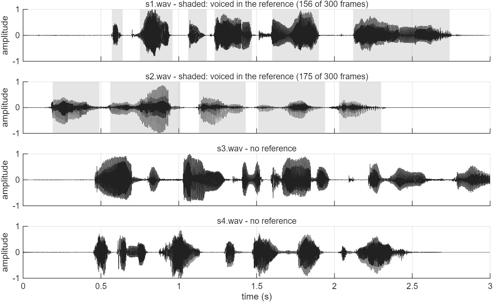

**Figure 1.** The four recordings. Grey bands on s1 and s2 mark the frames the reference calls voiced.

One property of the reference matters for everything that follows: **every reference value is exactly $8000/k$ for an integer $k$** (lags 22 to 102). The reference was therefore produced by a method that measures the period in whole samples, so it is itself the output of a detector, and it is quantised. Near 100 Hz neighbouring values are 1.25 Hz apart, near 200 Hz they are 5 Hz apart, near 333 Hz they are 14 Hz apart ($\Delta F \approx F_0^2/f_s$). Agreement with the reference cannot be tighter than this.

## 2. Framework common to both methods

Both detectors share everything except the function they search for a peak and the pre-processing that function needs.

| Item | Choice | Reason |
|---|---|---|
| Frame step | 10 ms (80 samples), 300 frames | matches the reference |
| Frame position | window centred on the middle of each 10 ms segment | natural reading of "one value per 10 ms"; tested in Section 5.5 |
| Search range | 70–400 Hz, lags 20–115 samples (2.5–14.4 ms) | covers the reference range 78–364 Hz |
| Peak refinement | parabola through the peak and its two neighbours | removes the whole-sample quantisation |
| Silence gate | a frame whose energy (30 ms window) is more than 30 dB below the loudest frame is unvoiced | both peak measures are amplitude-normalised and would otherwise find structure in silence |
| Voicing test | peak height at or above a threshold | Section 5.4 |
| Smoothing | 5-point median on the voicing decision and on the pitch | removes isolated errors [5] |

**Peak refinement.** With $y_{-1}, y_0, y_{+1}$ the function at the integer peak $\hat k$ and its neighbours, the peak of the fitted parabola is displaced by

$$\delta = \frac{1}{2}\,\frac{y_{-1}-y_{+1}}{y_{-1}-2y_0+y_{+1}}, \qquad \hat F_0 = \frac{f_s}{\hat k+\delta}.$$

**Smoothing.** The voicing flag of a frame becomes the majority of the five flags around it. The pitch of a voiced frame becomes the middle value of the voiced raw candidates among the same five frames. When their number is even, the lower of the two middle values is taken instead of their average, so the output is always a candidate that was actually measured. A single wrong value surrounded by correct ones is replaced; a real change in pitch is not smeared, which a linear filter would do.

**Error measures.** These follow the comparative study of Rabiner et al. [3], with the combined frame error of Chu and Alwan [6].

| Measure | Definition |
|---|---|
| V→UV | reference voiced, detector says unvoiced; % of reference-voiced frames |
| UV→V | reference unvoiced, detector says voiced; % of reference-unvoiced frames |
| VDE | voicing decision error: either of the above; % of all frames |
| GPE | gross pitch error: among frames voiced in both, pitch off by more than 20 % |
| Fine error | mean, standard deviation and mean absolute error over the remaining frames |
| FFE | $F_0$ frame error: frames with a voicing error or a gross error; % of all frames |
| Raw gross error | gross errors of the unsmoothed candidates on every reference-voiced frame, with no voicing test. Isolates the period estimator from the voicing detector, as in [1] |

## 3. Method A — autocorrelation (time domain)

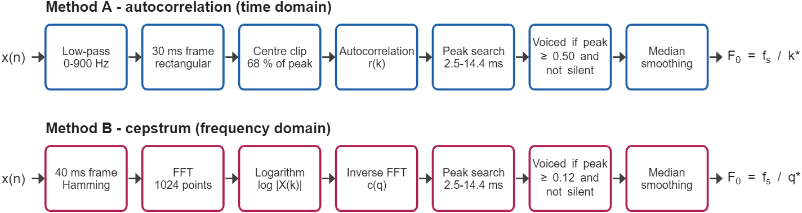

**Figure 2.** Processing chains of the two detectors as implemented. "Not silent" is the silence gate of Section 2.

### 3.1 Principle

The short-time autocorrelation of a frame $y(n)$ of $N$ samples is

$$R(k) = \sum_{n=0}^{N-1-k} y(n)\,y(n+k), \qquad r(k) = \frac{R(k)}{R(0)}.$$

If $y$ repeats every $P$ samples, the frame lines up with itself when shifted by $P$, so $r(k)$ has peaks at $k = P, 2P, \dots$. The pitch estimate is the lag of the largest peak in the search range:

$$\hat k = \arg\max_{20\le k\le 115} r(k), \qquad \hat F_0 = f_s/\hat k .$$

Because the sum has only $N-k$ terms, $r(k)$ carries a linear taper: for a perfectly periodic frame $r(P) = (N-P)/N$. The taper is useful for the peak search, because it makes the peak at $P$ taller than the one at $2P$ and so protects against choosing twice the period.

### 3.2 Why plain autocorrelation is not enough

Speech is a periodic excitation filtered by the vocal tract. The vocal tract resonances (formants) ring between pitch pulses, and the autocorrelation shows that ringing as extra peaks. When the first formant is strong these can rival the pitch peak. Rabiner's detector [1], built on Sondhi's centre clipper [4], removes the formant structure before correlating:

1. **Low-pass filter**, passband 0–900 Hz, stopband from 1700 Hz (41-tap linear-phase equiripple FIR). Keeps the first few harmonics and discards the higher formants.
2. **30 ms rectangular frame** (240 samples), at least two periods at 70 Hz.
3. **Centre clipping.** With $A_1$ and $A_3$ the peak magnitudes in the first and last thirds of the frame, the clipping level is $C_L = 0.68\,\min(A_1, A_3)$ and

$$y(n) = \begin{cases} x(n)-C_L, & x(n) > C_L\\ x(n)+C_L, & x(n) < -C_L\\ 0, & \text{otherwise.}\end{cases}$$

Only the tips of the largest excursions survive, one or two per pitch period. The frame becomes close to a pulse train, whose autocorrelation is zero except at multiples of the period.

4. **Autocorrelation**, computed as the inverse FFT of the power spectrum (Wiener–Khinchin), zero-padded to 512 points so that it equals the sum above.
5. **Voicing test.** The taper that helps the peak search would hurt a voicing test: with $N = 240$ a perfectly periodic frame can reach $r = 0.92$ at 400 Hz but only $0.52$ at 70 Hz, so a fixed threshold on $r$ is harder to pass for a low voice. The test therefore uses the taper-corrected peak

$$\rho = r(\hat k)\,\frac{N}{N-\hat k},$$

which is 1 for a periodic frame at any pitch. A frame is voiced if $\rho \ge 0.50$ and it is not silent.

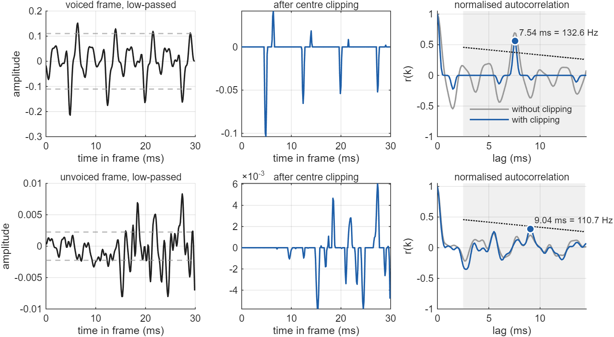

**Figure 3.** One voiced frame (top; s2, 0.695 s, reference 133.3 Hz) and one unvoiced frame (bottom; s2, 1.995 s) through the autocorrelation detector. Left: low-passed frame, dashed lines at $\pm C_L$. Centre: after centre clipping. Right: normalised autocorrelation without (grey) and with (blue) clipping; the shaded band is the search range and the dotted line is the voicing threshold drawn on $r(k)$, that is $0.50\,(N-k)/N$. In the voiced frame clipping leaves one clean peak at 7.54 ms (132.6 Hz, $r = 0.56$, $\rho = 0.75$). In the unvoiced frame the largest peak ($r = 0.31$, $\rho = 0.44$) stays below the threshold.

In the voiced frame of Figure 3 the unclipped autocorrelation (grey) oscillates over the whole lag range because of formant ringing; after clipping (blue) it is essentially zero everywhere except at the pitch lag. This is what "spectral flattening" buys.

### 3.3 Parameters

| Parameter | Value | Source |
|---|---|---|
| Low-pass filter | 0–900 Hz pass, 1700 Hz stop, 41 taps | Rabiner [1] |
| Window | 30 ms rectangular | Rabiner [1] |
| Clipping level | 68 % of the smaller of the first-third and last-third peaks | Rabiner [1] |
| Voicing threshold | $\rho \ge 0.50$ | tuned on s1 + s2 |

Rabiner [1] thresholds the uncorrected $r$ at 0.25. The taper correction is a change made here so that the voicing test does not depend on pitch.

## 4. Method B — cepstrum (frequency domain)

### 4.1 Principle

Model a voiced frame as an excitation $e(n)$ convolved with the vocal tract response $h(n)$. In the frequency domain the convolution is a product, and the logarithm turns the product into a sum:

$$x(n) = e(n) * h(n) \;\Rightarrow\; \log|X(\omega)| = \log|E(\omega)| + \log|H(\omega)| .$$

The excitation of voiced speech is a pulse train, so $|E(\omega)|$ is a comb of harmonics spaced $F_0$ apart: $\log|E|$ is a **fast, regular ripple** along the frequency axis. The vocal tract term $\log|H|$ is the **slow** envelope with a few formant bumps. A Fourier transform of the log spectrum separates fast from slow. That transform is the real cepstrum [2]:

$$c(q) = \frac{1}{L}\sum_{k=0}^{L-1} \log|X(k)|\; e^{\,j2\pi kq/L}, \qquad L = 1024 .$$

Its independent variable $q$ (quefrency) has units of time. The slow envelope lands at low quefrency (below about 2.5 ms). The ripple of spacing $F_0$ lands as a sharp peak at $q = 1/F_0$, the pitch period. So

$$\hat q = \arg\max_{20\le q\le 115} c(q), \qquad \hat F_0 = f_s/\hat q .$$

An unvoiced frame has no harmonic comb and therefore no peak.

### 4.2 Steps

1. **40 ms Hamming-windowed frame** (320 samples) of the unfiltered speech. The window must hold several pitch periods, otherwise the harmonics are not resolved in the spectrum and there is no ripple to find; the Hamming taper keeps harmonic sidelobes from filling the gaps between harmonics. Noll used 40 ms [2].
2. **1024-point FFT**, then $\log|X(k)|$.
3. **Inverse FFT** gives $c(q)$.
4. **Peak search** over 2.5–14.4 ms. Starting the search at 2.5 ms is itself the "liftering" that discards the vocal tract part.
5. **Voicing test**: voiced if $c(\hat q) \ge 0.12$ and the frame is not silent.

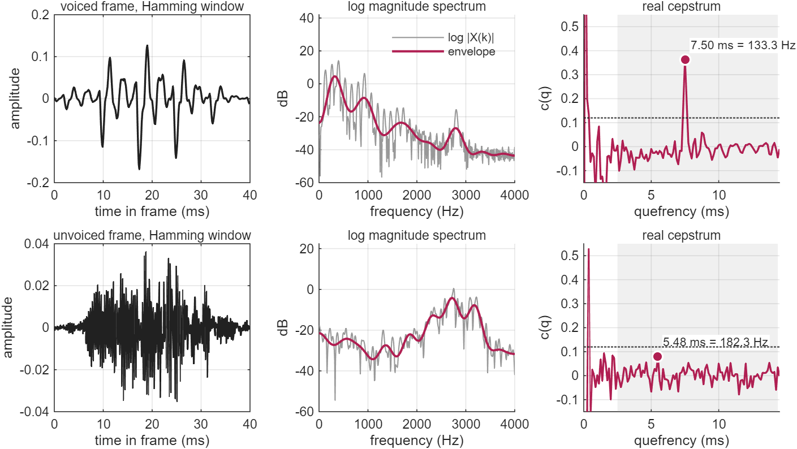

**Figure 4.** The same two frames through the cepstrum detector. Left: Hamming-windowed frame. Centre: log magnitude spectrum (grey) and its envelope, obtained by keeping only quefrencies below 2.5 ms (red). Right: real cepstrum with the search range shaded and the threshold dotted. The voiced frame has a harmonic ripple on the spectrum and a single cepstral peak at 7.50 ms (133.3 Hz, height 0.36). The unvoiced frame has neither (largest value 0.08).

### 4.3 Parameters

| Parameter | Value | Source |
|---|---|---|
| Window | 40 ms Hamming | Noll [2] |
| FFT length | 1024 | next power of two above 2 × 320 |
| Voicing threshold | $c(\hat q) \ge 0.12$ | tuned on s1 + s2 |

### 4.4 One spectrum, two nonlinearities

The two methods are closer than their names suggest. Both are an inverse Fourier transform of a function of the magnitude spectrum:

$$r(k) \;\propto\; \mathcal{F}^{-1}\{\,|X(\omega)|^{2}\,\}, \qquad c(q) = \mathcal{F}^{-1}\{\,\log|X(\omega)|\,\}.$$

The difference is the nonlinearity, and it gives a way to read the results that follow:

- **Squaring** lets the strongest spectral components dominate. Strong components are the least affected by noise; but the strongest components are the formants, so the method needs centre clipping to stop them competing with the pitch.
- **The logarithm** compresses the spectrum so that every harmonic counts about equally. Formants are flattened for free and the pitch peak is sharp and isolated; but weak, noise-dominated parts of the spectrum now count as much as strong ones, and the method needs many harmonics to be present.

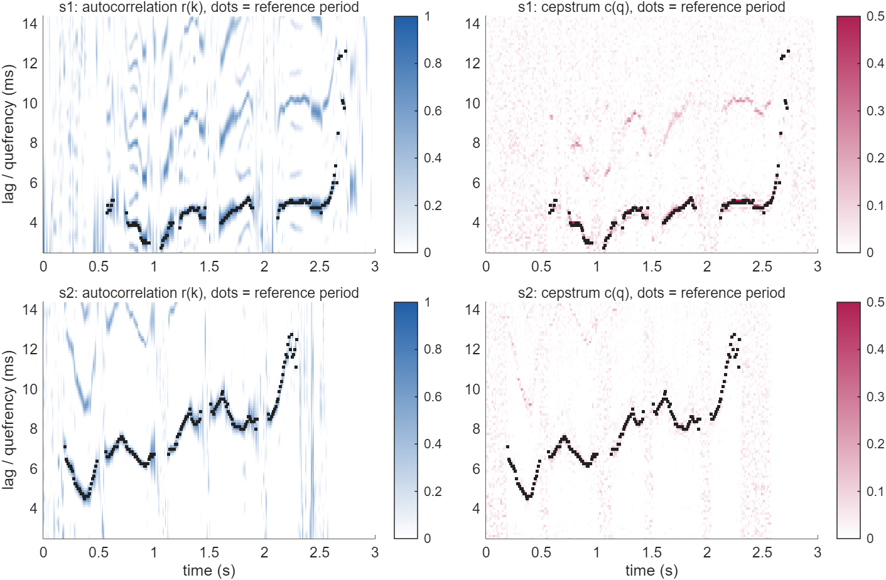

**Figure 5.** What each detector searches, for every frame of s1 (top) and s2 (bottom): clipped autocorrelation (left) and cepstrum (right) against lag or quefrency. Black dots are the reference period. The cepstrum colour scale saturates at 0.5. The autocorrelation ridge is broad and repeats at twice the period (visible for s1 near 8–10 ms). The cepstral ridge is thin and sits on a nearly empty background.

## 5. Results on the recordings with a reference (s1, s2)

### 5.1 Pitch tracks

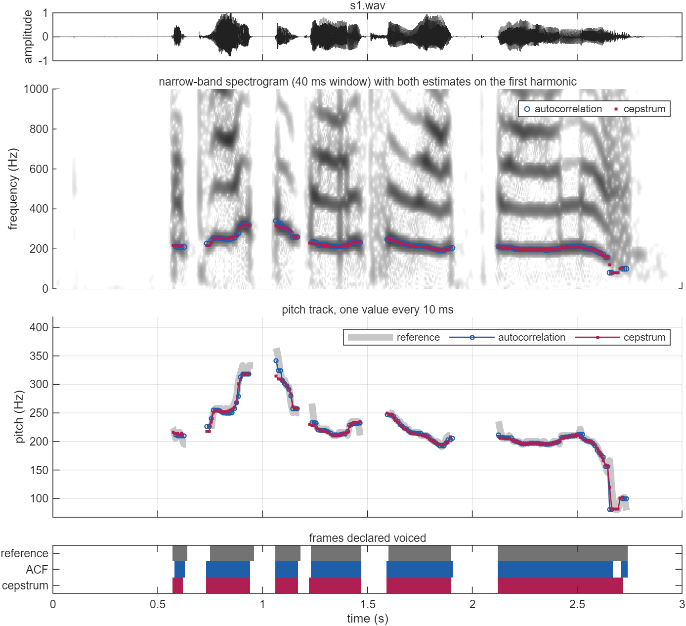

**Figure 6.** s1.wav. From the top: waveform; narrow-band spectrogram with both estimates plotted on it (they should lie on the lowest harmonic); pitch tracks against the reference; frames each track calls voiced.

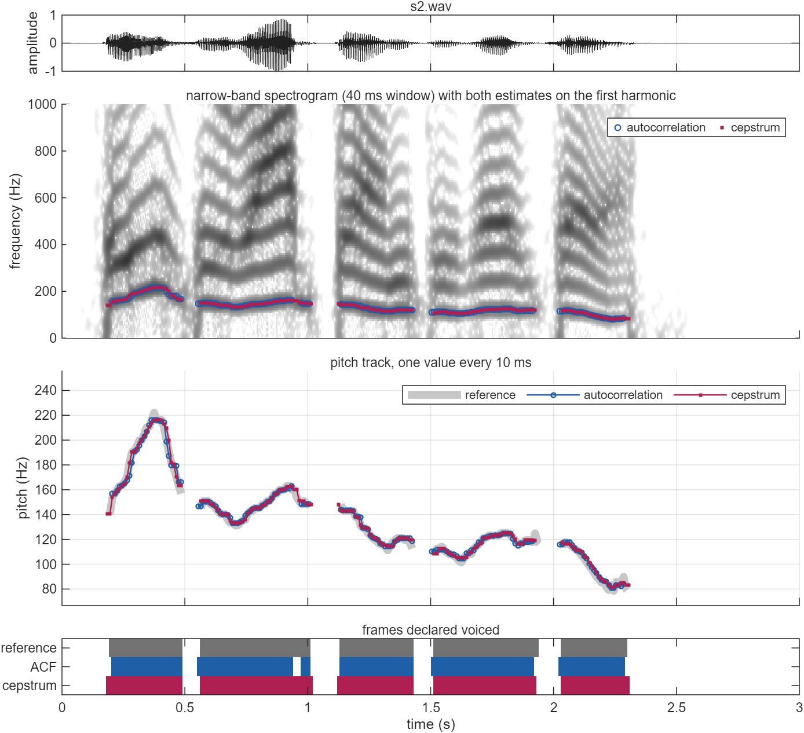

**Figure 7.** s2.wav, same layout.

Both tracks follow the reference through every voiced segment, including the fast rise and fall of s1 between 0.75 s and 1.2 s (220 → 330 → 250 Hz), and both lie on the first harmonic of the spectrogram. The differences are at the edges of segments and in two specific places:

- **Creaky ending of s1 (2.65–2.74 s, frames 266–274).** The reference itself jumps between 167, 118, 82, 81, 81, 99, 100, 103 and 79 Hz in consecutive frames. The voice here has irregular glottal pulses and no single period. Every gross error that survives smoothing, for either method, is in these nine frames (autocorrelation: frames 266, 267, 274; cepstrum: 266, 267). The cepstrum follows the reference down to 81 Hz; the autocorrelation loses the voicing for four frames.
- **Middle of a vowel in s2 (0.945–0.965 s).** The autocorrelation drops out for three frames inside a voiced segment. The frames straddle a sharp fall in amplitude (the peak level drops eight-fold within 30 ms), so the loud pulses at one end of the frame have only quiet ones to correlate with and the normalised peak is low ($\rho$ = 0.38 and 0.16 in the first two).

### 5.2 Error measures

| File | Method | Smoothing | V→UV % | UV→V % | VDE % | GPE % | Fine mean (Hz) | Fine std (Hz) | Fine MAE (Hz) | FFE % |
|---|---|---|---|---|---|---|---|---|---|---|
| s1 | Autocorrelation | none | 7.1 | 4.9 | 6.0 | 2.1 | −2.05 | 6.05 | 4.11 | 7.0 |
| s1 | Cepstrum | none | 5.8 | 4.9 | 5.3 | 2.0 | −2.23 | 6.26 | 3.92 | 6.3 |
| s1 | Autocorrelation | median | 5.8 | 2.8 | 4.3 | 2.0 | −2.13 | 6.86 | 4.56 | 5.3 |
| s1 | Cepstrum | median | 4.5 | 2.8 | 3.7 | 1.3 | −2.65 | 7.89 | 4.59 | 4.3 |
| s2 | Autocorrelation | none | 9.7 | 4.8 | 7.7 | 0.0 | 0.30 | 2.46 | 1.56 | 7.7 |
| s2 | Cepstrum | none | 0.6 | 3.2 | 1.7 | 0.0 | 0.39 | 2.26 | 1.25 | 1.7 |
| s2 | Autocorrelation | median | 4.0 | 2.4 | 3.3 | 0.0 | 0.27 | 2.41 | 1.58 | 3.3 |
| s2 | Cepstrum | median | 0.6 | 3.2 | 1.7 | 0.0 | 0.46 | 2.17 | 1.32 | 1.7 |
| **s1&nbsp;+&nbsp;s2** | **Autocorrelation** | **median** | **4.8** | **2.6** | **3.8** | **1.0** | −0.84 | 5.11 | 2.95 | **4.3** |
| **s1&nbsp;+&nbsp;s2** | **Cepstrum** | **median** | **2.4** | **3.0** | **2.7** | **0.6** | −0.96 | 5.78 | 2.82 | **3.0** |

What the table says:

- **Gross pitch errors are rare for both.** After smoothing, 3 frames of 315 for the autocorrelation and 2 of 323 for the cepstrum, all in the creaky ending of s1. On s2 neither method makes one.
- **Most of the frame error is voicing error.** Of the autocorrelation's 26 error frames, 23 are voicing errors; of the cepstrum's 18, 16 are. The cepstrum's advantage is in deciding voiced or unvoiced, not in measuring the period, and it comes mostly from s2 (1.7 % against 3.3 %); on s1 the two are close (4.3 % against 5.3 %).
- **Fine accuracy is the same**, and is set by the reference. The standard deviation is 2–2.5 Hz for the low voice and 7–8 Hz for the high voice, which is the size of the reference's own quantisation step at those pitches (Section 1). Both methods also share the same small offset on each file (about −2 Hz on s1, +0.3 to +0.5 Hz on s2), which points at the reference rather than at either detector.
- **Median smoothing matters more for the autocorrelation.** Its pooled FFE drops from 7.3 % to 4.3 %, the cepstrum's from 4.0 % to 3.0 %. On s2 the autocorrelation's missed voiced frames fall from 9.7 % to 4.0 %: isolated frames emptied by the clipper are filled in. The price is a slightly larger fine error on s1, where the median flattens the sharp pitch peak at 1.07 s (reference 364 Hz, smoothed tracks 342 and 315 Hz).

### 5.3 Pitch accuracy

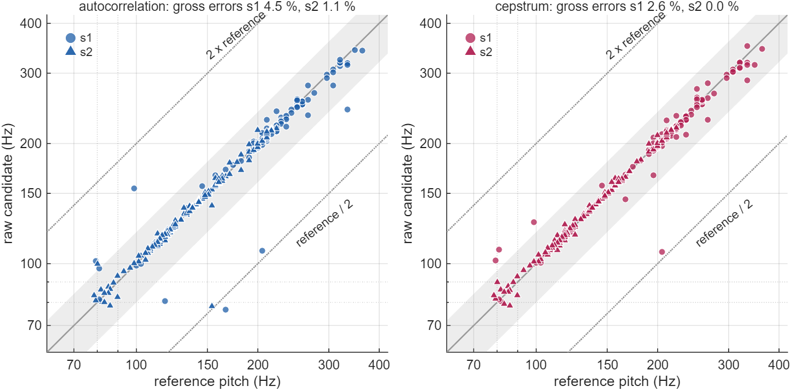

**Figure 8.** Raw pitch candidates (before the voicing test and smoothing) against the reference on every reference-voiced frame. The band is ±20 %; dotted lines mark octave errors.

| File | Method | Reference-voiced frames | Raw gross error | Half the reference | Double the reference | Other |
|---|---|---|---|---|---|---|
| s1 | Autocorrelation | 156 | 4.5 % (7 frames) | 2 | 0 | 5 |
| s1 | Cepstrum | 156 | 2.6 % (4 frames) | 1 | 0 | 3 |
| s2 | Autocorrelation | 175 | 1.1 % (2 frames) | 1 | 0 | 1 |
| s2 | Cepstrum | 175 | 0.0 % | 0 | 0 | 0 |

With the voicing decision taken out, the cepstrum's raw candidates are slightly more reliable, but the counts are small: 9 against 4 frames of 331. Octave errors are few; when they occur both methods pick **twice the period** (half the frequency), never half the period. Of the autocorrelation's seven raw errors on s1, five fall in the creaky ending (frames 266–274), where the reference is itself uncertain; so do three of the cepstrum's four.

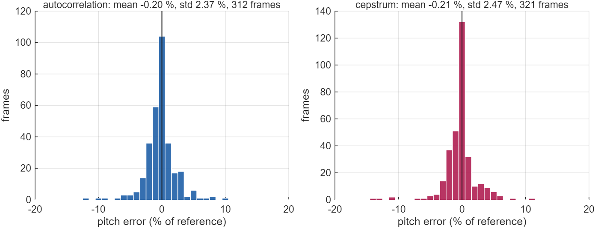

**Figure 9.** Distribution of the fine pitch error of the final tracks, s1 and s2 pooled, as a percentage of the reference.

Both distributions are centred near zero (mean −0.20 % and −0.21 %) with a standard deviation of about 2.4 %. 94.6 % of the autocorrelation's frames and 95.6 % of the cepstrum's are within 5 % of the reference.

### 5.4 Voicing decision

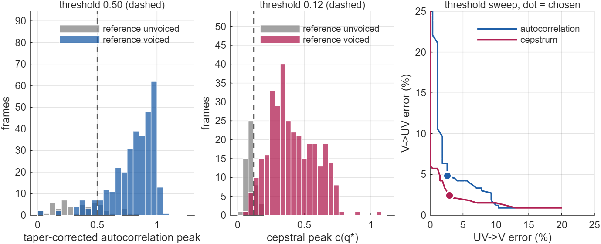

**Figure 10.** Left and centre: peak heights on the 380 frames (of 600) that pass the silence gate, 328 voiced and 52 unvoiced in the reference; the dashed line is the threshold used. Right: V→UV against UV→V as the threshold is swept, for the complete detector; the dot is the operating point used.

The silence gate does most of the work of rejecting unvoiced frames: 217 of the 269 reference-unvoiced frames never reach the peak test. The figure shows how the two peak measures deal with the 52 that do. The cepstral peak separates the classes more cleanly: unvoiced frames cluster below 0.12 and voiced frames spread from 0.12 upwards. The autocorrelation peak of unvoiced frames spreads from 0 to 0.75, well into the voiced distribution. These are frames at segment boundaries, where the 30 ms window overlaps a vowel, and low-level periodic sound that the reference labels unvoiced. As a result the cepstrum's trade-off curve lies below the autocorrelation's over the useful range (UV→V below about 10 %).

**Were the thresholds tuned on the test data?** Yes. The two thresholds and the silence gate were chosen on s1 + s2, the same frames that are scored, so the figures in Section 5.2 are optimistic. As a check, each threshold was also chosen on one file only and scored on the other:

| Tuned on | Scored on | Autocorrelation FFE | Cepstrum FFE |
|---|---|---|---|
| s1 | s2 | 4.7 % (threshold 0.46) | 2.0 % (threshold 0.110) |
| s2 | s1 | 5.3 % (threshold 0.50) | 5.0 % (threshold 0.125) |
| mean | | 5.0 % | 3.5 % |

The order of the two methods is the same out of sample (3.5 % against 5.0 %) as in sample (3.0 % against 4.3 %). These cross-tuned figures are the fairer estimate of how each detector would do on a new recording.

### 5.5 Frame alignment

The reference does not say where its analysis window sits within each 10 ms step. The window centre was moved either side of the mid-segment position and the pooled FFE recomputed:

| Shift of window centre | −10 ms | −7.5 ms | −5 ms | −2.5 ms | 0 (used) | +2.5 ms | +5 ms | +10 ms | +15 ms |
|---|---|---|---|---|---|---|---|---|---|
| Autocorrelation FFE % | 4.5 | 3.7 | 4.2 | 4.0 | 4.3 | 4.5 | 5.7 | 6.8 | 9.3 |
| Cepstrum FFE % | 3.0 | 3.7 | 3.2 | 2.7 | 3.0 | 3.7 | 4.0 | 6.2 | 7.7 |

The scores are flat to within about one percentage point from −10 ms to +2.5 ms and rise steadily for later positions, so the reference's alignment cannot be pinned down better than that, and a few frames of either method's error are alignment noise. The position was not tuned: the mid-segment choice was kept. At every shift the cepstrum's error is lower than or equal to the autocorrelation's.

## 6. Pitch estimates for s3 and s4

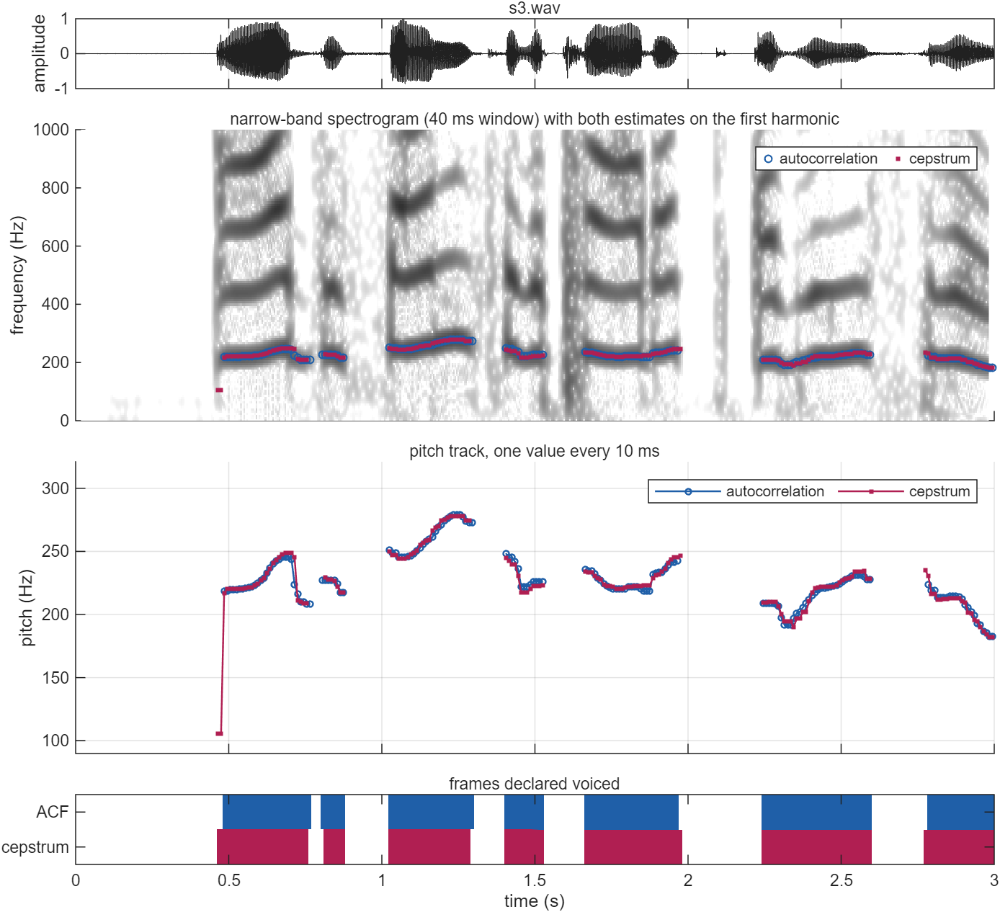

**Figure 11.** s3.wav. No reference exists; the spectrogram is the check. Both tracks lie on the first harmonic.

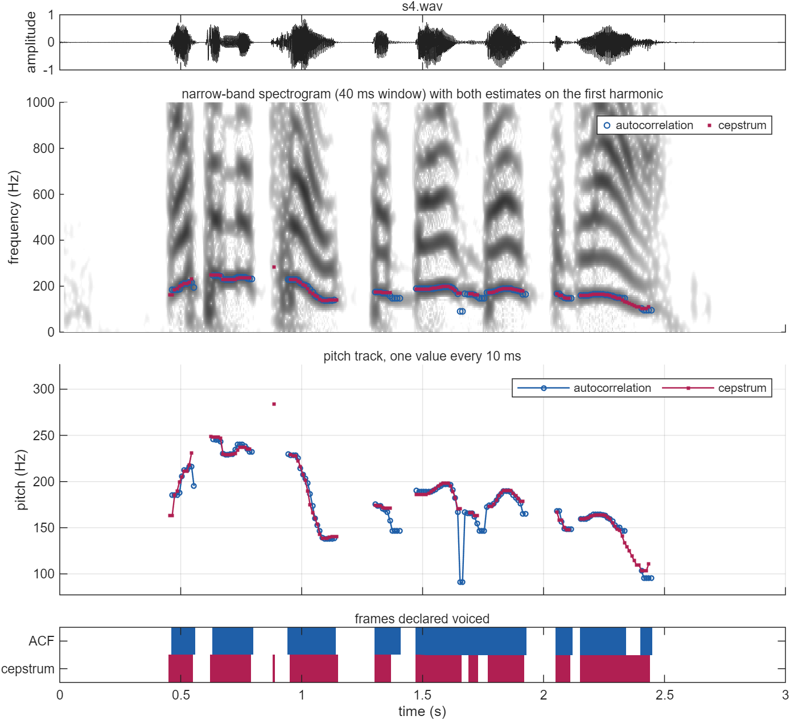

**Figure 12.** s4.wav.

| File | Method | Voiced frames | Mean (Hz) | Median (Hz) | Min (Hz) | Max (Hz) |
|---|---|---|---|---|---|---|
| s3 | Autocorrelation | 167 | 227.7 | 223.9 | 182.3 | 279.2 |
| s3 | Cepstrum | 168 | 226.3 | 223.0 | 105.7 | 278.2 |
| s4 | Autocorrelation | 135 | 178.3 | 174.5 | 90.9 | 245.9 |
| s4 | Cepstrum | 128 | 179.9 | 175.0 | 103.4 | 284.1 |

**s3** is a high-pitched voice, about 180–280 Hz with a median of 223 Hz, in seven voiced segments; the last one is cut off by the end of the file. **s4** is lower, about 105–250 Hz with a median of 175 Hz, ending in a fall to about 105 Hz. (The extreme minima and maxima in the table are the errors listed below, not real pitch.)

The complete tracks are in `p3.mat` and `p4.mat` (variables `p3_acf`, `p3_cep`, `p4_acf`, `p4_cep`, each 300 × 1 in Hz with 0 for unvoiced, as in p1 and p2), in `assets/pitch_tracks.csv`, and in Appendix A.

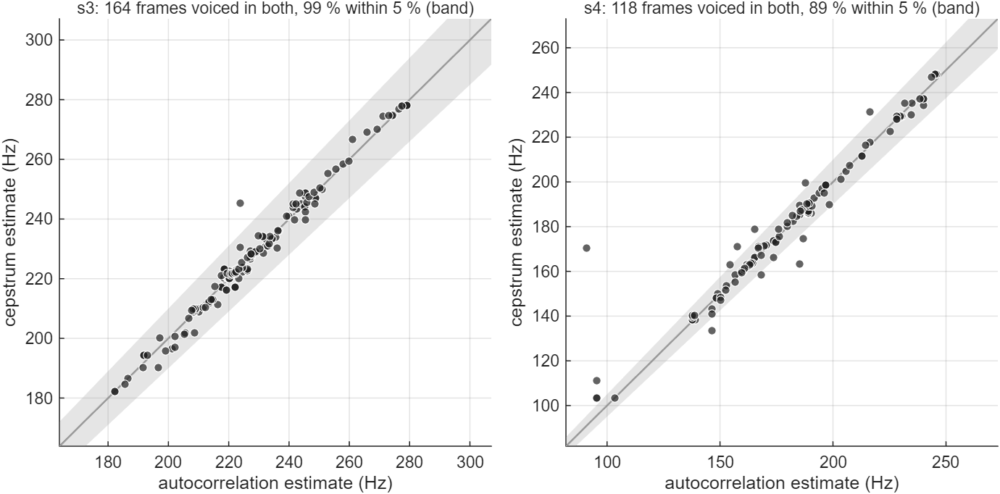

**Figure 13.** Autocorrelation against cepstrum estimate on frames both call voiced. The band is ±5 %.

| File | Same voicing decision | Frames voiced in both | Within 5 % | Within 20 % | Mean absolute difference |
|---|---|---|---|---|---|
| s1 | 96.7 % | 147 | 98.0 % | 99.3 % | 2.4 Hz |
| s2 | 95.7 % | 168 | 98.2 % | 100.0 % | 1.1 Hz |
| s3 | 97.7 % | 164 | 99.4 % | 100.0 % | 1.8 Hz |
| s4 | 91.0 % | 118 | 89.0 % | 99.2 % | 3.4 Hz |

With no reference, the spectrogram and the agreement between two methods are the available evidence. Agreement is not accuracy, since the two methods can be wrong together, but they fail in different ways (Section 4.4), and on s1 and s2, where the truth is known, frames on which they agree are almost always right. s3 shows the same level of agreement as s1 and s2. **s4 is the harder recording.** The places where the methods part show each method's weakness and say which value to trust:

- **Fast pitch fall at the end of s4 (2.34–2.40 s).** The pitch falls from 140 Hz to about 105 Hz. The cepstrum follows it smoothly (130, 125, 119, 114, 109 Hz), on the spectrogram's first harmonic. The autocorrelation declares these six frames unvoiced: its peak is weak ($\rho$ = 0.35–0.55 in five of them) and two of its raw candidates jump to 250 and 380 Hz, so the voicing vote rejects the stretch. The cepstrum value is the better estimate.
- **1.655–1.665 s of s4 (autocorrelation octave error).** The autocorrelation reports 91 Hz for two frames between neighbours at 165–170 Hz (the cepstrum gives 170 Hz in the first of them): it chose twice the period.
- **0.465–0.475 s of s3 and 0.885 s of s4 (cepstrum errors).** The cepstrum reports 106 Hz in the first two frames of s3, half the 218 Hz that follows, and one isolated voiced frame at 284 Hz in a quiet gap of s4. The autocorrelation calls all three frames unvoiced.
- **1.66–1.77 s and 1.37–1.41 s of s4 (cepstrum misses).** The autocorrelation keeps these stretches voiced at 146–172 Hz with a strong peak ($\rho$ up to 0.96); the cepstral peak is only 0.06–0.13 and the cepstrum drops out. The spectrogram shows the lowest harmonics continuing and little above them. A voiced sound with few harmonics gives the cepstrum no ripple to find.

## 7. Comparison beyond the clean recordings

### 7.1 Noise

White Gaussian noise was added to s1 and s2 at signal-to-noise ratios from 30 dB down to 0 dB, 20 noise realisations each. The SNR is the ratio of average powers over the whole 3 s including the silences; the speech-active frames are about 2 dB better than the label. Thresholds were left at their clean-speech values.

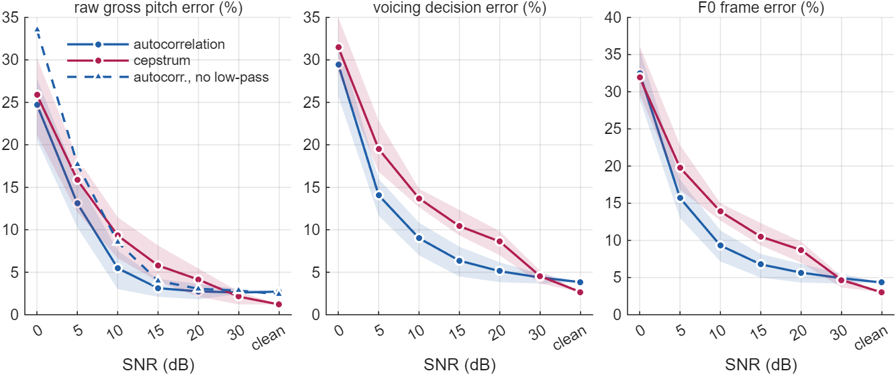

**Figure 14.** Errors against SNR, s1 and s2 pooled. Line: mean of 20 trials. Band: minimum to maximum. The dashed line in the left panel is the autocorrelation detector with its low-pass filter removed.

| SNR (dB) | Raw gross error % (ACF / cepstrum) | ACF without low-pass | VDE % (ACF / cepstrum) | FFE % (ACF / cepstrum) |
|---|---|---|---|---|
| clean | 2.7 / 1.2 | 2.4 | 3.8 / 2.7 | 4.3 / 3.0 |
| 30 | 2.6 / 2.1 | 2.8 | 4.4 / 4.5 | 4.9 / 4.7 |
| 20 | 2.7 / 4.1 | 3.1 | 5.1 / 8.6 | 5.7 / 8.7 |
| 15 | 3.1 / 5.8 | 4.0 | 6.4 / 10.4 | 6.8 / 10.5 |
| 10 | 5.5 / 9.3 | 8.5 | 9.0 / 13.7 | 9.3 / 13.9 |
| 5 | 13.1 / 15.9 | 17.7 | 14.1 / 19.5 | 15.7 / 19.8 |
| 0 | 24.7 / 25.9 | 33.5 | 29.5 / 31.5 | 32.5 / 31.9 |

- **The order reverses between 30 dB and 20 dB.** From 20 dB down to 5 dB the autocorrelation detector has the lower error on every measure: at 10 dB its frame error is 9.3 % against the cepstrum's 13.9 %. At 30 dB the two are level, and at 0 dB both have failed (about 32 %).
- **The cepstrum degrades first and fastest.** Its frame error nearly triples between clean and 20 dB (3.0 % to 8.7 %), while the autocorrelation's rises from 4.3 % to 5.7 %. The logarithm gives the bins between harmonics, and the band above about 3 kHz where speech is weak, the same weight as the harmonics; once those bins hold noise the ripple is diluted and the peak falls below a threshold that was set on clean speech. Part of this loss is therefore threshold drift, which re-tuning for the noise level would recover.
- **Much of the autocorrelation's robustness is its low-pass filter.** The filter passes 30 % of the white-noise power (−5.2 dB) and nearly all of the low harmonics. With the filter removed (dashed line) the autocorrelation's raw gross error is still below the cepstrum's from 20 dB to 10 dB, but above it at 5 dB and 0 dB (33.5 % against 25.9 %). The claim that survives is: the autocorrelation detector **as built, with its pre-filter**, is the more robust in white noise.

### 7.2 Sensitivity to window length and clipping level

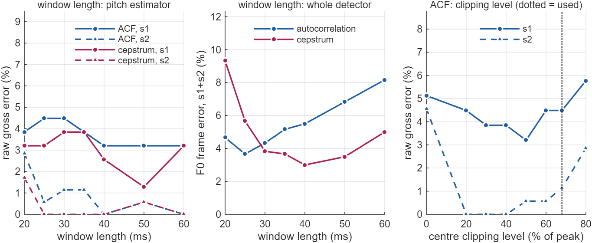

**Figure 15.** Left: raw gross error against window length (both methods given the same length). Centre: frame error of the complete detectors against window length, thresholds and silence gate fixed. Right: raw gross error of the autocorrelation method against clipping level; 0 % is low-pass filtering with no clipping.

| Window (ms) | 20 | 25 | 30 | 35 | 40 | 50 | 60 |
|---|---|---|---|---|---|---|---|
| Autocorrelation FFE % | 4.7 | 3.7 | 4.3 | 5.2 | 5.5 | 6.8 | 8.2 |
| Cepstrum FFE % | 9.3 | 5.7 | 3.8 | 3.7 | 3.0 | 3.5 | 5.0 |

- **Window length.** The cepstrum needs a long window: its frame error is 9.3 % at 20 ms and 3.0–3.8 % from 30 ms to 50 ms. At 20 ms a 100 Hz voice contributes only two periods, too few for a harmonic comb. The autocorrelation is best with a short window (3.7 % at 25 ms) and degrades to 8.2 % at 60 ms, because a long rectangular window reaches further across voicing boundaries and pitch changes. Its raw gross error barely changes with window length, so the loss is in voicing, not in period measurement. Below 30 ms the autocorrelation is the better detector; from 30 ms up the cepstrum is. Comparing each at its best length gives 3.7 % against 3.0 %. (Thresholds were tuned at 30 ms and 40 ms, so the table slightly favours those two lengths.)
- **Clipping level.** Centre clipping matters most for the low voice: s2 has 4.6 % raw gross errors with low-pass filtering alone and none with 20–40 % clipping. The literature value of 68 % is not the optimum on these two recordings (1.1 % on s2 and 4.5 % on s1; 50 % gives 0.6 % and 3.2 %). The level was kept at 68 % rather than tuned to the scored files. These differences are one to three frames and should not be over-read.

### 7.3 Computation

| | Autocorrelation | Cepstrum |
|---|---|---|
| Per frame | 41-tap FIR, clip, two 512-point FFTs | two 1024-point FFTs, a logarithm per bin |
| Measured, one 3 s recording (300 frames) | about 5–7 ms | about 12–16 ms |

Timings are from MATLAB `timeit` on a laptop for this vectorised implementation and vary between runs; the ratio stays near 2.5. It is an implementation figure, not a complexity result: most of it is the FFT length (512 against 1024). Both run several hundred times faster than real time. In fixed-point hardware the gap would widen, because the autocorrelation of a centre-clipped signal can be computed with additions only (Rabiner's three-level clipper [1]), while the cepstrum needs a logarithm per bin.

### 7.4 Summary

| Aspect | Autocorrelation | Cepstrum |
|---|---|---|
| Domain | time (lag) | frequency → quefrency |
| Frame errors, clean speech (s1 + s2) | 4.3 % | **3.0 %** |
| Same, thresholds tuned on the other file | 5.0 % | **3.5 %** |
| Gross pitch errors after smoothing | 1.0 % (3 frames) | 0.6 % (2 frames) |
| Fine accuracy | same (≈ 2.4 % std, limited by the reference) | same |
| Voiced / unvoiced separation | weaker: boundary frames score high | **cleaner**: peak present or absent |
| Frame errors at 10 dB SNR (white noise) | **9.3 %** | 13.9 % |
| Best window | **25 ms** | 40 ms |
| Typical failures | drop-outs when amplitude or pitch changes fast, twice-the-period errors | few-harmonic voiced sounds, noise, half-pitch at onsets |
| Cost | **1×** | ≈ 2.5× |
| Pre-processing needed | low-pass filter and centre clipper | none |

## 8. Limitations

- **Small test set.** Two recordings, two speakers, 600 frames, 11 voiced segments. One frame is 0.17 %. Errors cluster at the 22 segment boundaries, so they are not independent, and the clean-speech gap of 8 frames (18 against 26) is suggestive, not conclusive. What is consistent is the direction: the cepstrum was better than or equal to the autocorrelation in every clean-speech configuration tried (thresholds in or out of sample, every alignment, windows of 30 ms and above), by 0 to about 3 percentage points.
- **Parameters chosen on the scored data.** The two thresholds and the 30 dB silence gate were chosen on s1 + s2. The gate matters: it removes 217 of 269 unvoiced frames before either peak is consulted. Section 5.4 gives the cross-tuned figures.
- **Two pipelines, not two principles.** The detectors differ in more than the nonlinearity: window length and shape (30 ms rectangular against 40 ms Hamming), a pre-filter for one only, a taper correction for one only. Each was built the way its literature recommends; the comparison is of the two complete detectors as built here.
- **The reference is not ground truth.** It is another detector's output, quantised to whole-sample periods, with doubtful frames in the creaky ending of s1. Fine-error figures measure agreement with it, not accuracy, and are too coarse to rank the two methods or to show the benefit of sub-sample refinement.
- **Noise model.** White Gaussian noise only, thresholds fixed. Low-frequency or periodic interference (hum, a second talker) would fall inside the autocorrelation's 0–900 Hz band and could change the picture.
- **No tracking.** Each frame is decided on its own, with only a 5-point median afterwards. The errors that remain in s3 and s4 (Section 6) last two to six frames, too long for the median. A tracker that penalises octave jumps (dynamic programming) is the usual next step.

## 9. Conclusions

1. **Both methods work.** On clean speech each places the pitch within 5 % of the reference on about 95 % of voiced frames, with gross errors on at most 1 % after median smoothing, all of them in a creaky passage where the reference is itself unsure. The fine accuracy is the same and is limited by the reference's quantisation.
2. **On clean speech the cepstrum is somewhat better, as a voicing detector.** Its frame error is 3.0 % against 4.3 % (3.5 % against 5.0 % with thresholds tuned out of sample). The logarithm flattens the formants, so a voiced frame gives one sharp isolated peak and an unvoiced frame gives none. The margin is a handful of frames and depends on configuration; the direction does not.
3. **In white noise the autocorrelation detector is better.** From 20 dB to 5 dB SNR it has the lower error on every measure (9.3 % against 13.9 % at 10 dB). Much of that comes from its 900 Hz low-pass filter; the rest from squaring, which keeps it locked to the strong low harmonics while the logarithm gives noisy spectral regions equal weight.
4. **They fail differently**, as the single difference between them, $|X|^2$ against $\log|X|$, suggests. The autocorrelation needs centre clipping to suppress formants, loses frames whose amplitude or pitch changes quickly, and occasionally picks twice the period. The cepstrum needs a long window and many harmonics, and misses voiced sounds that have few.
5. **s3 and s4.** s3 has a pitch of about 180–280 Hz (median 223 Hz) and s4 about 105–250 Hz (median 175 Hz). The two estimates agree within 5 % on 99.4 % and 89.0 % of jointly voiced frames. Where they differ in s4, the spectrogram identifies which one is right; for the final fall of s4 it is the cepstrum.
6. **Choice.** For clean, full-band recordings with no latency constraint, the cepstrum. For noisy signals, short windows or low-cost hardware, the centre-clipped autocorrelation. Since their errors rarely coincide, running both and flagging disagreement is a cheap reliability check, and it is what Section 6 does.

## References

1. L. R. Rabiner, "On the use of autocorrelation analysis for pitch detection," *IEEE Trans. Acoustics, Speech, and Signal Processing*, vol. ASSP-25, no. 1, pp. 24–33, Feb. 1977.
2. A. M. Noll, "Cepstrum pitch determination," *J. Acoustical Society of America*, vol. 41, no. 2, pp. 293–309, 1967.
3. L. R. Rabiner, M. J. Cheng, A. E. Rosenberg and C. A. McGonegal, "A comparative performance study of several pitch detection algorithms," *IEEE Trans. Acoustics, Speech, and Signal Processing*, vol. ASSP-24, no. 5, pp. 399–418, Oct. 1976.
4. M. M. Sondhi, "New methods of pitch extraction," *IEEE Trans. Audio and Electroacoustics*, vol. AU-16, no. 2, pp. 262–266, June 1968.
5. L. R. Rabiner, M. R. Sambur and C. E. Schmidt, "Applications of a nonlinear smoothing algorithm to speech processing," *IEEE Trans. Acoustics, Speech, and Signal Processing*, vol. ASSP-23, no. 6, pp. 552–557, Dec. 1975.
6. W. Chu and A. Alwan, "Reducing F0 frame error of F0 tracking algorithms under noisy conditions with an unvoiced/voiced classification frontend," *Proc. IEEE ICASSP*, 2009, pp. 3969–3972.

## Appendix A. Pitch estimates for s3.wav and s4.wav

One value per 10 ms frame, in Hz, rounded to the nearest hertz. A dot is an unvoiced or silent frame. The row label is the start time of the row; columns step by 10 ms. Values to 0.1 Hz are in `assets/pitch_tracks.csv`.

**s3.wav, autocorrelation (Hz)**

| t (s) | +0 | +10 | +20 | +30 | +40 | +50 | +60 | +70 | +80 | +90 ms |
|---|---|---|---|---|---|---|---|---|---|---|
| 0.0 | · | · | · | · | · | · | · | · | · | · |
| 0.1 | · | · | · | · | · | · | · | · | · | · |
| 0.2 | · | · | · | · | · | · | · | · | · | · |
| 0.3 | · | · | · | · | · | · | · | · | · | · |
| 0.4 | · | · | · | · | · | · | · | · | 218 | 218 |
| 0.5 | 220 | 220 | 220 | 220 | 220 | 221 | 221 | 222 | 223 | 225 |
| 0.6 | 227 | 229 | 233 | 237 | 240 | 242 | 244 | 246 | 246 | 246 |
| 0.7 | 244 | 224 | 216 | 210 | 210 | 208 | 208 | · | · | · |
| 0.8 | 227 | 227 | 227 | 227 | 227 | 224 | 218 | 218 | · | · |
| 0.9 | · | · | · | · | · | · | · | · | · | · |
| 1.0 | · | · | 251 | 249 | 249 | 245 | 245 | 245 | 246 | 247 |
| 1.1 | 248 | 250 | 253 | 255 | 258 | 260 | 261 | 266 | 269 | 271 |
| 1.2 | 274 | 276 | 278 | 279 | 279 | 279 | 277 | 274 | 273 | 273 |
| 1.3 | · | · | · | · | · | · | · | · | · | · |
| 1.4 | 248 | 245 | 245 | 242 | 236 | 222 | 222 | 222 | 223 | 226 |
| 1.5 | 226 | 226 | 226 | · | · | · | · | · | · | · |
| 1.6 | · | · | · | · | · | · | 236 | 234 | 234 | 232 |
| 1.7 | 229 | 227 | 224 | 223 | 222 | 220 | 220 | 220 | 220 | 220 |
| 1.8 | 222 | 222 | 222 | 222 | 220 | 218 | 218 | 218 | 232 | 233 |
| 1.9 | 233 | 234 | 236 | 239 | 241 | 241 | 242 | · | · | · |
| 2.0 | · | · | · | · | · | · | · | · | · | · |
| 2.1 | · | · | · | · | · | · | · | · | · | · |
| 2.2 | · | · | · | · | 209 | 209 | 209 | 209 | 208 | 207 |
| 2.3 | 197 | 192 | 192 | 192 | 197 | 201 | 202 | 206 | 209 | 212 |
| 2.4 | 215 | 218 | 219 | 221 | 221 | 221 | 222 | 222 | 223 | 224 |
| 2.5 | 226 | 228 | 229 | 230 | 231 | 231 | 231 | 230 | 227 | 227 |
| 2.6 | · | · | · | · | · | · | · | · | · | · |
| 2.7 | · | · | · | · | · | · | · | · | 224 | 219 |
| 2.8 | 219 | 213 | 213 | 213 | 214 | 215 | 215 | 215 | 214 | 212 |
| 2.9 | 208 | 205 | 202 | 199 | 193 | 192 | 187 | 186 | 182 | 182 |

**s3.wav, cepstrum (Hz)**

| t (s) | +0 | +10 | +20 | +30 | +40 | +50 | +60 | +70 | +80 | +90 ms |
|---|---|---|---|---|---|---|---|---|---|---|
| 0.0 | · | · | · | · | · | · | · | · | · | · |
| 0.1 | · | · | · | · | · | · | · | · | · | · |
| 0.2 | · | · | · | · | · | · | · | · | · | · |
| 0.3 | · | · | · | · | · | · | · | · | · | · |
| 0.4 | · | · | · | · | · | · | 106 | 106 | 217 | 220 |
| 0.5 | 220 | 220 | 220 | 220 | 220 | 221 | 222 | 222 | 223 | 224 |
| 0.6 | 227 | 229 | 233 | 236 | 241 | 243 | 245 | 248 | 249 | 249 |
| 0.7 | 249 | 245 | 211 | 210 | 209 | 209 | · | · | · | · |
| 0.8 | · | 229 | 227 | 227 | 227 | 222 | 217 | 217 | · | · |
| 0.9 | · | · | · | · | · | · | · | · | · | · |
| 1.0 | · | · | 250 | 247 | 247 | 244 | 244 | 244 | 246 | 248 |
| 1.1 | 249 | 250 | 255 | 257 | 258 | 259 | 267 | 269 | 270 | 274 |
| 1.2 | 275 | 277 | 278 | 278 | 278 | 278 | 278 | 275 | 275 | · |
| 1.3 | · | · | · | · | · | · | · | · | · | · |
| 1.4 | 245 | 242 | 240 | 240 | 230 | 217 | 217 | 217 | 220 | 223 |
| 1.5 | 223 | 223 | 223 | · | · | · | · | · | · | · |
| 1.6 | · | · | · | · | · | · | 234 | 234 | 234 | 231 |
| 1.7 | 229 | 227 | 224 | 222 | 222 | 222 | 220 | 220 | 220 | 221 |
| 1.8 | 222 | 222 | 222 | 222 | 222 | 223 | 223 | 223 | 229 | 231 |
| 1.9 | 232 | 234 | 236 | 241 | 244 | 245 | 245 | 247 | · | · |
| 2.0 | · | · | · | · | · | · | · | · | · | · |
| 2.1 | · | · | · | · | · | · | · | · | · | · |
| 2.2 | · | · | · | · | 209 | 209 | 210 | 210 | 210 | 207 |
| 2.3 | 200 | 194 | 194 | 194 | 190 | 197 | 197 | 202 | 202 | 210 |
| 2.4 | 217 | 221 | 222 | 222 | 222 | 222 | 222 | 222 | 223 | 225 |
| 2.5 | 227 | 228 | 229 | 230 | 234 | 234 | 234 | 234 | 228 | 228 |
| 2.6 | · | · | · | · | · | · | · | · | · | · |
| 2.7 | · | · | · | · | · | · | · | 235 | 230 | 216 |
| 2.8 | 216 | 212 | 212 | 212 | 212 | 213 | 213 | 213 | 213 | 210 |
| 2.9 | 209 | 201 | 201 | 196 | 194 | 190 | 187 | 184 | 182 | 182 |

**s4.wav, autocorrelation (Hz)**

| t (s) | +0 | +10 | +20 | +30 | +40 | +50 | +60 | +70 | +80 | +90 ms |
|---|---|---|---|---|---|---|---|---|---|---|
| 0.0 | · | · | · | · | · | · | · | · | · | · |
| 0.1 | · | · | · | · | · | · | · | · | · | · |
| 0.2 | · | · | · | · | · | · | · | · | · | · |
| 0.3 | · | · | · | · | · | · | · | · | · | · |
| 0.4 | · | · | · | · | · | · | 185 | 185 | 185 | 188 |
| 0.5 | 206 | 213 | 213 | 216 | 216 | 195 | · | · | · | · |
| 0.6 | · | · | · | 246 | 245 | 245 | 244 | 230 | 229 | 229 |
| 0.7 | 230 | 230 | 235 | 240 | 240 | 240 | 238 | 235 | 232 | 232 |
| 0.8 | · | · | · | · | · | · | · | · | · | · |
| 0.9 | · | · | · | · | 230 | 228 | 228 | 228 | 225 | 214 |
| 1.0 | 207 | 204 | 198 | 187 | 174 | 160 | 153 | 147 | 139 | 138 |
| 1.1 | 138 | 138 | 138 | 139 | · | · | · | · | · | · |
| 1.2 | · | · | · | · | · | · | · | · | · | · |
| 1.3 | 175 | 174 | 174 | 171 | 170 | 167 | 158 | 147 | 146 | 146 |
| 1.4 | 146 | · | · | · | · | · | · | 190 | 189 | 189 |
| 1.5 | 189 | 189 | 189 | 189 | 190 | 192 | 194 | 195 | 197 | 197 |
| 1.6 | 197 | 196 | 191 | 182 | 167 | 91 | 91 | 167 | 165 | 165 |
| 1.7 | 165 | 162 | 154 | 146 | 146 | 146 | 172 | 174 | 174 | 176 |
| 1.8 | 180 | 184 | 186 | 189 | 189 | 189 | 189 | 186 | 182 | 180 |
| 1.9 | 176 | 165 | 165 | · | · | · | · | · | · | · |
| 2.0 | · | · | · | · | · | 168 | 168 | 157 | 149 | 148 |
| 2.1 | 148 | 148 | · | · | · | 160 | 160 | 160 | 161 | 162 |
| 2.2 | 164 | 164 | 164 | 164 | 164 | 163 | 161 | 160 | 157 | 153 |
| 2.3 | 150 | 150 | 146 | 146 | · | · | · | · | · | · |
| 2.4 | 103 | 96 | 96 | 96 | 96 | · | · | · | · | · |
| 2.5 | · | · | · | · | · | · | · | · | · | · |
| 2.6 | · | · | · | · | · | · | · | · | · | · |
| 2.7 | · | · | · | · | · | · | · | · | · | · |
| 2.8 | · | · | · | · | · | · | · | · | · | · |
| 2.9 | · | · | · | · | · | · | · | · | · | · |

**s4.wav, cepstrum (Hz)**

| t (s) | +0 | +10 | +20 | +30 | +40 | +50 | +60 | +70 | +80 | +90 ms |
|---|---|---|---|---|---|---|---|---|---|---|
| 0.0 | · | · | · | · | · | · | · | · | · | · |
| 0.1 | · | · | · | · | · | · | · | · | · | · |
| 0.2 | · | · | · | · | · | · | · | · | · | · |
| 0.3 | · | · | · | · | · | · | · | · | · | · |
| 0.4 | · | · | · | · | · | 163 | 163 | 186 | 190 | 200 |
| 0.5 | 205 | 211 | 211 | 218 | 231 | · | · | · | · | · |
| 0.6 | · | · | 248 | 248 | 248 | 248 | 247 | 229 | 229 | 229 |
| 0.7 | 229 | 229 | 230 | 234 | 237 | 237 | 237 | 235 | 235 | · |
| 0.8 | · | · | · | · | · | · | · | · | 284 | · |
| 0.9 | · | · | · | · | · | 229 | 228 | 228 | 222 | 216 |
| 1.0 | 207 | 201 | 190 | 175 | 166 | 160 | 154 | 143 | 138 | 138 |
| 1.1 | 138 | 140 | 140 | 140 | 140 | · | · | · | · | · |
| 1.2 | · | · | · | · | · | · | · | · | · | · |
| 1.3 | 174 | 174 | 174 | 172 | 171 | 171 | 171 | · | · | · |
| 1.4 | · | · | · | · | · | · | · | 186 | 186 | 186 |
| 1.5 | 186 | 186 | 187 | 189 | 191 | 193 | 195 | 197 | 198 | 198 |
| 1.6 | 198 | 195 | 189 | 182 | 170 | 170 | · | · | · | 166 |
| 1.7 | 166 | 163 | 163 | · | · | · | · | 173 | 173 | 175 |
| 1.8 | 180 | 185 | 188 | 190 | 190 | 190 | 190 | 187 | 185 | 182 |
| 1.9 | 179 | 179 | · | · | · | · | · | · | · | · |
| 2.0 | · | · | · | · | · | 167 | 159 | 159 | 150 | 148 |
| 2.1 | 148 | · | · | · | · | 160 | 160 | 160 | 161 | 162 |
| 2.2 | 164 | 164 | 164 | 164 | 164 | 163 | 161 | 159 | 155 | 152 |
| 2.3 | 148 | 147 | 141 | 133 | 130 | 125 | 119 | 114 | 109 | 109 |
| 2.4 | 104 | 104 | 103 | 111 | · | · | · | · | · | · |
| 2.5 | · | · | · | · | · | · | · | · | · | · |
| 2.6 | · | · | · | · | · | · | · | · | · | · |
| 2.7 | · | · | · | · | · | · | · | · | · | · |
| 2.8 | · | · | · | · | · | · | · | · | · | · |
| 2.9 | · | · | · | · | · | · | · | · | · | · |

## Appendix B. Files, reproduction and checks

| File | Content |
|---|---|
| `D2_code_2026EEY7565.m` | complete MATLAB script: both detectors, scoring, all tests, all figures |
| `p3.mat`, `p4.mat` | pitch tracks for s3 and s4, both methods |
| `assets/fig01` … `fig15` | figures of this report |
| `assets/results_log.txt` | console output; every number in this report is taken from it |
| `assets/metrics_s1_s2.csv` | the table of Section 5.2 |
| `assets/pitch_tracks.csv` | all tracks, frame by frame |

MATLAB R2025b with the Signal Processing Toolbox. From the folder holding the script, with `speech_samples/` beside it or one level up:

```
matlab -batch "D2_code_2026EEY7565"
```

The random seed is fixed, so the noise test reproduces exactly; only the timing line of the log changes between runs.

Two checks were made on the implementation:

- **Synthetic signals.** The script first runs both detectors on harmonic signals of 90, 150, 220 and 330 Hz and stops if either is off by more than 0.6 %.
- **Independent re-implementation.** Both detectors, the voicing rule, the smoother and the scoring were written a second time in Python (NumPy/SciPy) from the description in Sections 2–4, without reference to the MATLAB code. All 120 values of the table in Section 5.2 agree to round-off (largest difference $10^{-14}$), and all eight pitch tracks agree on the voicing of every frame and on the pitch to within the 0.1 Hz rounding of the CSV file.
