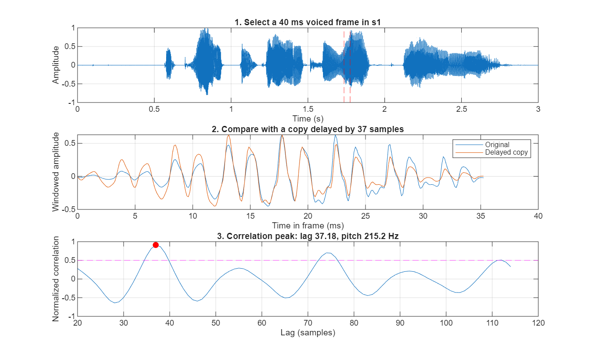
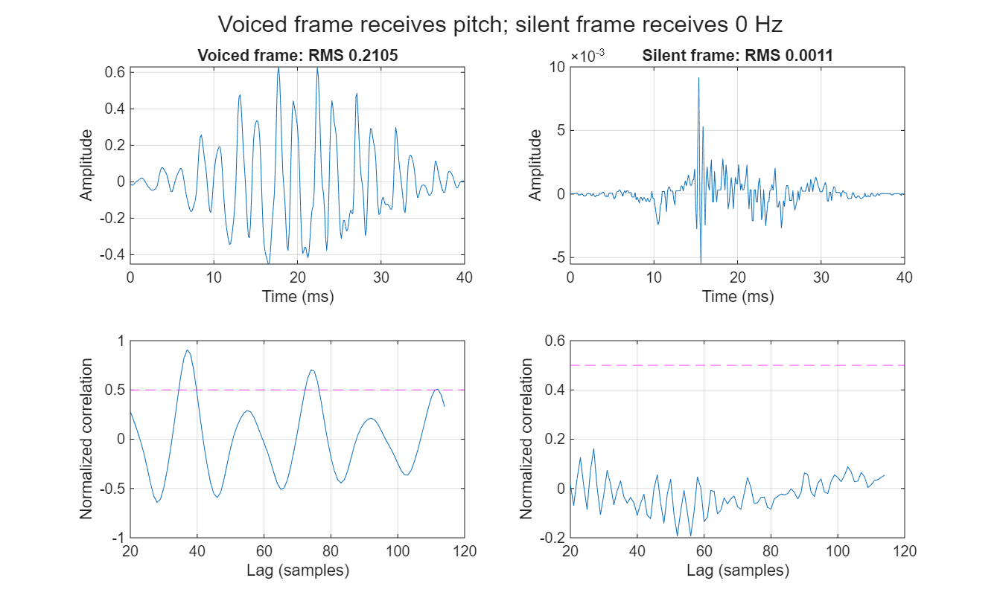
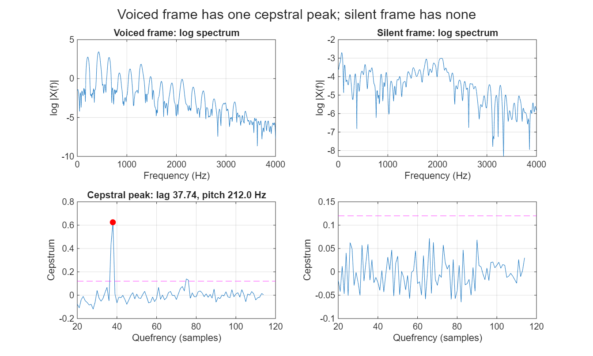
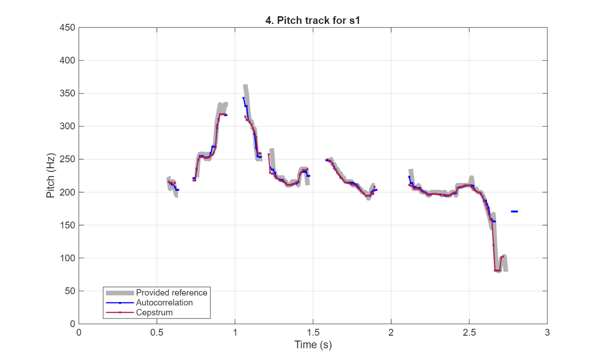
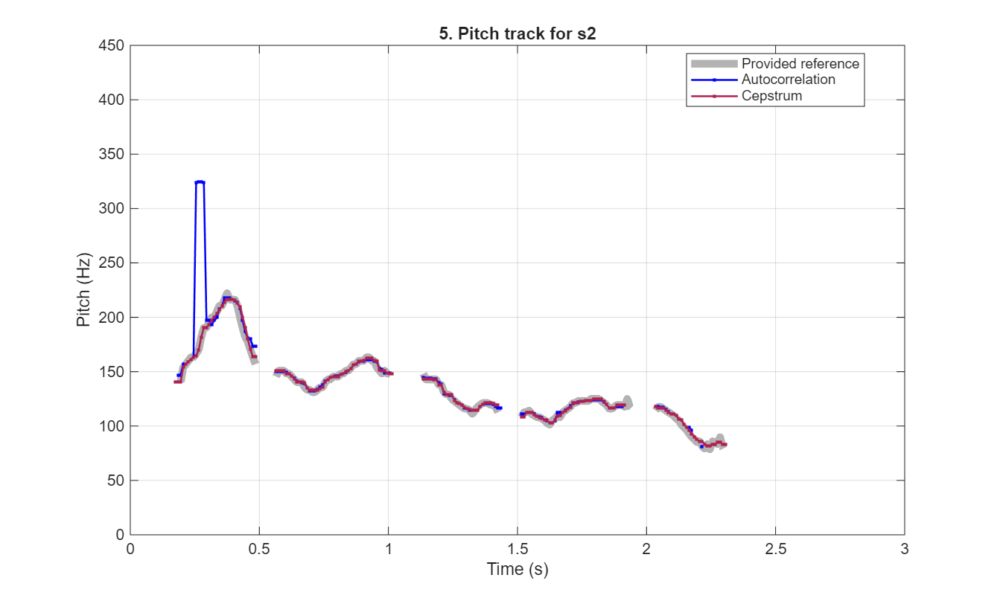
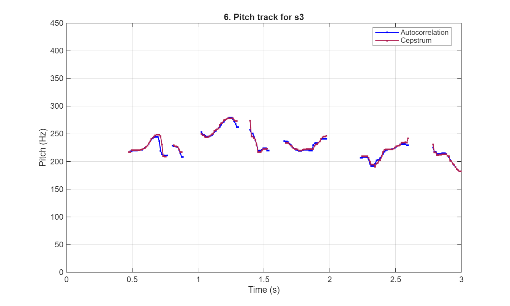
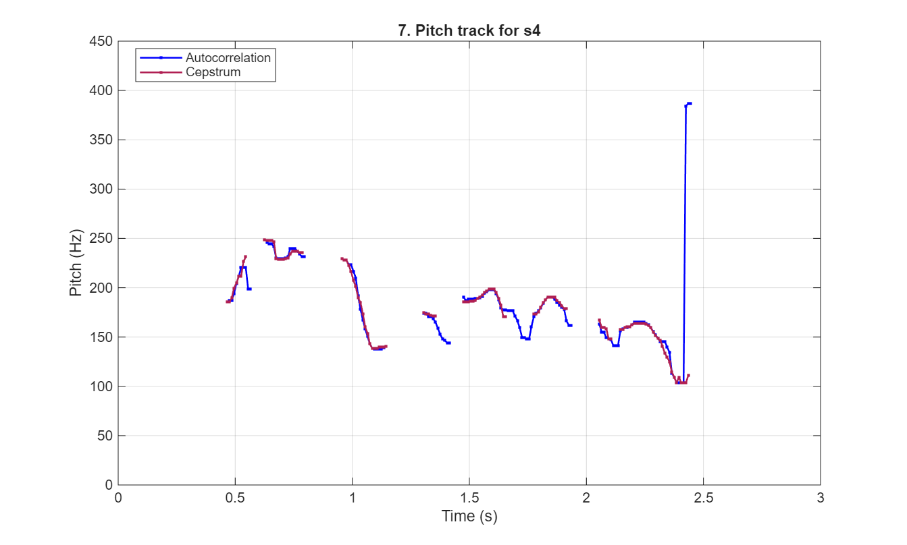
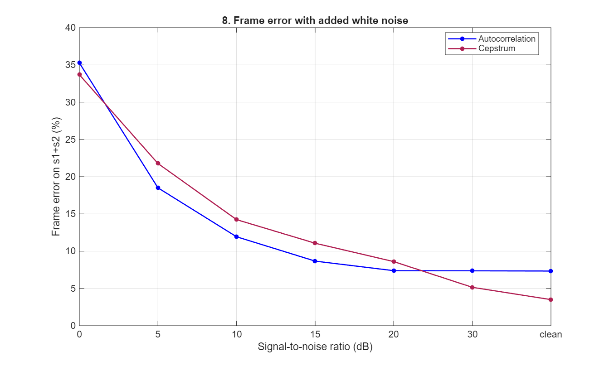

# Pitch Detection: Autocorrelation (Time Domain) vs Cepstrum (Frequency Domain)

**ELL7420 Advanced Digital Signal Processing — Design Assignment 2**

Naivedya Sahu · 2026EEY7565 · with project partner · October 2026

> [!summary] Result in one paragraph
> Two pitch detectors were implemented in MATLAB and run on the same frames: **autocorrelation** (time domain) and **cepstrum** (frequency domain). They share the 40 ms frames, the quiet-frame test, the peak picker and the median filter, and differ only in the curve that is searched for a peak. On the two recordings with a reference (600 frames) the cepstrum makes about half as many frame errors on clean speech, **3.5 % against 7.3 %** (21 against 44 frames). It misses fewer voiced frames, and its only two gross pitch errors fall in a creaky passage where the reference is itself unsure; the autocorrelation loses the low-pitched ending of s2 and doubles the pitch for four frames. In white noise the order reverses between 30 dB and 20 dB SNR: from 20 dB down to 5 dB the autocorrelation has the lower error (11.9 % against 14.2 % at 10 dB). Pitch tracks for s3.wav and s4.wav are given in Section 6 and Appendix A; the two methods agree within 5 % on 97.6 % (s3) and 93.3 % (s4) of the frames both call voiced.

## 1. Problem and data

Pitch detection estimates the fundamental frequency $F_0$ of a quasi-periodic signal. For speech it has two parts: decide whether a short segment is **voiced** (vocal folds vibrating, periodic) or **unvoiced** (noise-like or silent), and, if voiced, measure the period.

The assignment asks for one time-domain and one frequency-domain method, a comparison of the two on the recordings that have a reference, and pitch estimates for the two recordings that do not.

| Recording | Reference | Voiced frames (reference) | Reference pitch range | Note |
|---|---|---|---|---|
| s1.wav | p1.mat | 156 of 300 | 79–364 Hz, median 211 Hz | high-pitched voice, creaky ending |
| s2.wav | p2.mat | 175 of 300 | 78–222 Hz, median 125 Hz | low-pitched voice |
| s3.wav | none | to be found | to be found | speech runs to the end of the file |
| s4.wav | none | to be found | to be found | |

All four recordings are 3 s long, sampled at $f_s = 8$ kHz, 16 bit. The references hold one value every 10 ms (300 values); zero means unvoiced or silence.

One property of the reference matters later: **every reference value is exactly $8000/k$ for an integer $k$** (lags 22 to 102). The reference is therefore the output of some detector that measures the period in whole samples. Agreement with it is not quite the same as being right, and it cannot be tighter than the spacing of those values (5 Hz near 200 Hz, 14 Hz near 333 Hz).

## 2. What the two methods share

The two detectors are built to differ in one thing only. Everything in this section is common to both.

| Item | Choice |
|---|---|
| Frame step | 10 ms (80 samples), 300 frames per recording, matching the reference |
| Frame | 40 ms (320 samples) centred on the middle of each 10 ms step, mean removed, Hamming window |
| Search range | lags 20–114 samples (2.5–14.25 ms), that is 400 Hz down to 70 Hz |
| Quiet-frame test | a frame whose RMS amplitude is below 0.008 is unvoiced |
| Peak picker | the earliest local peak that reaches 82 % of the tallest local peak, refined by a parabola |
| Voicing test | the height of that peak must reach a threshold: 0.50 (autocorrelation), 0.12 (cepstrum) |
| Smoothing | 5-frame median on the voicing decision and on the pitch |

**Peak picker.** Both curves can peak at the period and again at its multiples. Taking the *earliest* peak that is nearly as tall as the tallest one favours the true period over twice the period. With $y_{-1}, y_0, y_{+1}$ the curve at the chosen integer lag $\hat k$ and its neighbours, a parabola through the three points moves the peak by

$$\delta = \frac{1}{2}\,\frac{y_{-1}-y_{+1}}{y_{-1}-2y_0+y_{+1}}, \qquad \hat F_0 = \frac{f_s}{\hat k+\delta},$$

limited to half a sample.

**Smoothing.** A frame stays voiced only if most of the five frames around it are voiced. Its pitch becomes the middle value of the voiced ones among those five (the lower of the two middle values when their number is even, so the output is always a value that was actually measured). The scores are reported with and without this filter.

**Error measures.** With the reference as the answer key, each frame is one of four cases.

| Measure | Definition |
|---|---|
| TP, FP, FN, TN | reference voiced and detector voiced; reference unvoiced but detector voiced; reference voiced but detector unvoiced; both unvoiced |
| Precision | TP / (TP + FP): of the frames called voiced, how many were |
| Recall | TP / (TP + FN): of the voiced frames, how many were found |
| MAE | mean absolute pitch difference over the TP frames |
| Within 20 % | TP frames whose pitch is within 20 % of the reference, counted over all reference-voiced frames |
| Frame error | share of all frames that are wrong in either way: FP, FN, or a TP frame more than 20 % off (a gross error) |

## 3. Method A — autocorrelation (time domain)

### 3.1 Principle

Autocorrelation asks how well a frame matches a delayed copy of itself. At lag $k$ the overlapping samples of the frame $y(n)$ and of its copy are multiplied and added, and the sum is divided by the energies of the two overlapping parts:

$$r(k) = \frac{\displaystyle\sum_{n=0}^{L-1-k} y(n)\,y(n+k)}{\sqrt{\displaystyle\sum_{n=0}^{L-1-k} y(n)^2 \;\sum_{n=0}^{L-1-k} y(n+k)^2}}, \qquad L = 320 .$$

If the frame repeats every $P$ samples, the copy lines up with the original at $k = P$ and $r(k)$ has a peak there. The pitch is $F_0 = f_s/P$.

Dividing by both energies does two jobs. It removes loudness, so a quiet vowel and a loud one give the same peak height. It also removes the effect of the shrinking overlap: a plain sum has fewer terms at long lags and would fall away for that reason alone.

One effect remains. The Hamming window shapes the two overlapping parts differently, so even a perfectly periodic frame does not reach 1, and it reaches less the longer the lag. For an ideal periodic tone this detector gives $r = 0.94$ at 300 Hz, $0.86$ at 150 Hz and $0.69$ at 85 Hz. A low voice therefore starts closer to the 0.50 threshold than a high one. This shows up in the results (Section 5.3).

**Figure 1.** Autocorrelation on one voiced frame of s1 (near 1.755 s). Top: the 40 ms frame selected. Middle: the frame and its copy delayed by 37 samples; they nearly coincide. Bottom: normalised correlation against lag, with the 0.50 threshold (dashed); the peak at 37.18 samples gives 215.2 Hz.

**Figure 2.** A voiced frame (left, RMS 0.2105) and a quiet frame (right, near 0.205 s, RMS 0.0011) of s1 with their correlation curves. The voiced frame has a peak well above 0.50. The quiet frame fails the RMS test and its curve has no such peak.

### 3.2 Steps and parameters

1. Take the 40 ms frame, remove its mean, apply the Hamming window.
2. Stop if the RMS is below 0.008: unvoiced.
3. Compute $r(k)$ for lags 20–114.
4. Pick the earliest local peak that reaches 82 % of the tallest, refine it with the parabola.
5. Voiced if that peak is at least 0.50; then $F_0 = f_s/\hat k$.

## 4. Method B — cepstrum (frequency domain)

### 4.1 Principle

Voiced speech is a train of pulses from the vocal folds, $e(n)$, shaped by the mouth and throat, $h(n)$. In the frequency domain the shaping is a multiplication, and the logarithm turns the multiplication into a sum:

$$x(n) = e(n) * h(n) \;\Rightarrow\; \log|X(f)| = \log|E(f)| + \log|H(f)| .$$

Because the pulses are regular, $|E(f)|$ is a comb of harmonics spaced $F_0$ apart, so $\log|E|$ is a **fast, regular ripple** along the frequency axis. The mouth's part, $\log|H|$, is a **slow** envelope with a few humps. An inverse Fourier transform of the log spectrum separates fast from slow. That transform is the real cepstrum [2]:

$$c(q) = \frac{1}{N}\sum_{m=0}^{N-1} \log|X(m)|\; e^{\,j2\pi mq/N}, \qquad N = 1024 .$$

Its variable $q$ (quefrency) is a time, counted here in samples exactly like the lag of the autocorrelation. The slow envelope lands at small $q$, below the search range. A ripple that repeats every $F_0$ Hz lands as one sharp peak at $q = f_s/F_0$, the pitch period. An unvoiced frame has no harmonics, so no ripple and no peak.

One way to see why: $c(q)$ is the log spectrum multiplied by a cosine of the frequency axis, $\cos(2\pi f q)$, and added up. The crests of that cosine are $1/q$ Hz apart. When $1/q$ equals the harmonic spacing, every crest sits on a harmonic and everything adds; for any other $q$ crests fall on harmonics and gaps alike and the sum cancels.

**Figure 3.** The two frames of Figure 2 through the cepstrum. Top: log magnitude spectra. The voiced frame (left) has a regular ripple, one bump per harmonic; the quiet frame (right) has none. Bottom: cepstra over the search range with the 0.12 threshold (dashed). The voiced frame has one sharp peak at 37.74 samples, 212.0 Hz, close to the 215.2 Hz found by the autocorrelation. The quiet frame stays below the threshold.

### 4.2 Steps and parameters

1. Take the same prepared frame as Method A (40 ms, mean removed, Hamming window).
2. Stop if the RMS is below 0.008: unvoiced.
3. 1024-point FFT, logarithm of the magnitude, inverse FFT. Keep quefrencies 20–114.
4. Pick the peak with the same rule as Method A.
5. Voiced if that peak is at least 0.12; then $F_0 = f_s/\hat q$.

### 4.3 One spectrum, two nonlinearities

The two methods are closer than their names suggest. By the Wiener–Khinchin relation the autocorrelation is the inverse Fourier transform of the power spectrum, so both curves are an inverse transform of a function of the magnitude spectrum:

$$R(k) = \mathcal{F}^{-1}\{\,|X(f)|^{2}\,\}, \qquad c(q) = \mathcal{F}^{-1}\{\,\log|X(f)|\,\}.$$

- **Squaring** lets the strongest parts of the spectrum dominate. Those are the least affected by noise, but they are also the resonances of the mouth, which put peaks of their own into the curve.
- **The logarithm** levels the spectrum so that every harmonic counts about equally. The mouth's shape is pushed out of the way and the pitch peak is sharp and alone; but weak, noisy parts of the spectrum now count as much as strong ones.

With everything else held equal, as it is here, this one difference is what the results measure.

## 5. Results on the recordings with a reference (s1, s2)

### 5.1 Pitch tracks

**Figure 4.** s1: both estimates (median-filtered) over the supplied reference.

**Figure 5.** s2: both estimates over the supplied reference. The autocorrelation jumps to about 324 Hz near 0.26 s and stops early at the end.

Both tracks follow the reference through every voiced segment, including the fast rise and fall of s1 between 0.75 s and 1.2 s.

### 5.2 Scores

| File | Method | Filter | TP | FP | FN | TN | Prec. % | Recall % | MAE (Hz) | Within 20 % | Error % |
|---|---|---|---|---|---|---|---|---|---|---|---|
| s1 | Autocorrelation | none | 147 | 13 | 9 | 131 | 91.9 | 94.2 | 7.16 | 143/156 | 8.7 |
| s1 | Autocorrelation | median | 146 | 13 | 10 | 131 | 91.8 | 93.6 | 4.59 | 145/156 | 8.0 |
| s1 | Cepstrum | none | 148 | 8 | 8 | 136 | 94.9 | 94.9 | 4.98 | 145/156 | 6.3 |
| s1 | Cepstrum | median | 149 | 6 | 7 | 138 | 96.1 | 95.5 | 5.07 | 147/156 | 5.0 |
| s2 | Autocorrelation | none | 160 | 2 | 15 | 123 | 98.8 | 91.4 | 5.69 | 156/175 | 7.0 |
| s2 | Autocorrelation | median | 161 | 2 | 14 | 123 | 98.8 | 92.0 | 5.37 | 157/175 | 6.7 |
| s2 | Cepstrum | none | 172 | 4 | 3 | 121 | 97.7 | 98.3 | 1.26 | 172/175 | 2.3 |
| s2 | Cepstrum | median | 173 | 4 | 2 | 121 | 97.7 | 98.9 | 1.35 | 173/175 | 2.0 |
| **s1&nbsp;+&nbsp;s2** | **Autocorrelation** | **median** | **307** | **15** | **24** | **254** | **95.3** | **92.7** | **5.00** | **302/331** | **7.3** |
| **s1&nbsp;+&nbsp;s2** | **Cepstrum** | **median** | **322** | **10** | **9** | **259** | **97.0** | **97.3** | **3.07** | **320/331** | **3.5** |

"Filter" is the 5-frame median; "Error" is the frame error. Without the median filter the pooled frame errors are 7.8 % (autocorrelation) and 4.3 % (cepstrum).

### 5.3 Where the errors are

- **Missed voiced frames (FN).** 24 for the autocorrelation, 9 for the cepstrum. Eleven of the autocorrelation's are the low-pitched ending of s2 (frames 219–230, reference 78–90 Hz). There the correlation at the true lag is low, 0.17–0.42 in the four frames checked, below the 0.50 threshold. This is the window effect of Section 3.1: at such long lags even a perfect tone would only reach about 0.69. The cepstrum keeps all of these frames. Both methods lose part of the creaky ending of s1 (autocorrelation frames 268–274, cepstrum 273–274), where the reference itself jumps between 167, 118, 82 and 99 Hz from one frame to the next.
- **False voiced frames (FP).** 15 against 10. Most sit one or two frames outside a voiced segment, where the 40 ms window already reaches into the vowel. The autocorrelation also calls four frames after the end of s1 voiced (frames 278–281).
- **Gross pitch errors.** Five for the autocorrelation, two for the cepstrum. Four of the five are s2 frames 26–29 (0.255–0.285 s), reported near 324 Hz where the reference is 167–190 Hz: **double the pitch**. In those frames the correlation near half the true lag is 0.6–0.7, within 82 % of the true peak (0.69–0.78), so the "earliest strong peak" rule takes the half lag. The cause is a strong second harmonic. The cepstrum, given the same rule on the same frames, is not misled, because the logarithm has levelled that harmonic. Its two gross errors (s1 frames 266–267) and the autocorrelation's fifth (frame 267) are in the creaky ending.
- **Pitch value.** On matched frames the mean absolute error is 5.00 Hz against 3.07 Hz. The gap comes from the doubled frames: on s1, which has none, the two are level (4.59 and 5.07 Hz).
- **Median filter.** It helps both a little (7.8 % to 7.3 %, 4.3 % to 3.5 %). It removes isolated wrong values, three of the autocorrelation's eight raw gross errors among them, but a run of four wrong frames is too long for a 5-frame median.

## 6. Pitch estimates for s3 and s4

**Figure 6.** s3: both estimates. No reference exists.

**Figure 7.** s4: both estimates. The autocorrelation track ends with three frames near 385 Hz.

| File | Method | Voiced frames (of 300) | Median pitch |
|---|---|---|---|
| s3 | Autocorrelation | 174 | 223 Hz |
| s3 | Cepstrum | 168 | 223 Hz |
| s4 | Autocorrelation | 145 | 177 Hz |
| s4 | Cepstrum | 122 | 181 Hz |

**s3** is a high-pitched voice, about 180–280 Hz with a median of 223 Hz; its last voiced segment is cut off by the end of the file. **s4** is lower, about 105–250 Hz with a median near 180 Hz, ending in a fall to about 105 Hz.

The complete tracks are in `results/p3.mat` and `results/p4.mat` (variables `p3_autocorrelation`, `p3_cepstrum`, `p4_autocorrelation`, `p4_cepstrum`, each 300 × 1 in Hz with 0 for unvoiced, as in p1 and p2), in `results/s3_pitch.csv` and `results/s4_pitch.csv`, and in Appendix A.

With no reference, the two methods can only be checked against each other. Agreement is not accuracy, since both can be wrong together; but Section 5 showed that they fail in different places, and on s1 and s2 a frame on which they agree is almost always right.

| File | Same voiced decision | Frames voiced in both | Within 5 % of each other | Mean difference |
|---|---|---|---|---|
| s1 | 94.0 % | 148 | 95.9 % | 2.9 Hz |
| s2 | 94.7 % | 162 | 95.1 % | 4.7 Hz |
| s3 | 97.3 % | 167 | 97.6 % | 2.2 Hz |
| s4 | 90.3 % | 119 | 93.3 % | 7.1 Hz |

s3 is the easiest of the four recordings: the two tracks differ in the voiced decision on only 8 frames and never by more than 20 % in pitch. **s4 is the hardest**, and the disagreements are of two kinds.

- **The last three voiced frames of the autocorrelation (2.425–2.445 s)** read 384–387 Hz where the cepstrum reads 103–111 Hz (and unvoiced in the third). The pitch has been falling steadily to about 105 Hz, so the cepstrum is right; the autocorrelation has locked on to a lag at the short end of the search range.
- **26 frames that only the autocorrelation calls voiced**, mostly two stretches between syllables (1.365–1.415 s and 1.665–1.765 s), at 144–177 Hz in line with the pitch on either side. Judging by a narrow-band spectrogram, these are weak sounds with little energy above the lowest harmonics. The waveform still repeats, so the autocorrelation finds a period, but with so few harmonics there is no ripple for the cepstrum to find. Without a reference this cannot be settled, but the autocorrelation is probably right to call them voiced.

For s4 the safer track is therefore the cepstrum for the pitch values and the autocorrelation for these weak voiced stretches.

## 7. Noise

The recordings are clean. To see how each method behaves when they are not, white Gaussian noise was added to s1 and s2 at signal-to-noise ratios from 30 dB down to 0 dB (ratio of average powers over the whole recording), ten realisations each, with every threshold left as it was.

**Figure 8.** Frame error on s1 + s2 against SNR, median-filtered tracks, mean of ten trials.

| SNR (dB) | clean | 30 | 20 | 15 | 10 | 5 | 0 |
|---|---|---|---|---|---|---|---|
| Autocorrelation frame error % | 7.3 | 7.4 | 7.4 | 8.7 | 11.9 | 18.5 | 35.3 |
| Cepstrum frame error % | 3.5 | 5.1 | 8.6 | 11.1 | 14.2 | 21.8 | 33.7 |

- **The order reverses between 30 dB and 20 dB.** From 20 dB down to 5 dB the autocorrelation has the lower error. At 0 dB both have failed, with about a third of the frames wrong.
- **The autocorrelation barely notices noise down to 20 dB** (7.3 % to 7.4 %), while the cepstrum's error more than doubles (3.5 % to 8.6 %). This is the difference of Section 4.3. Squaring keeps the autocorrelation on the strong low harmonics, which stand well above the noise. The logarithm gives the gaps between harmonics, and the upper band where speech is weak, the same weight as the harmonics; once those hold noise the ripple is diluted and the cepstral peak sinks below a threshold that was set on clean speech.
- **Part of the loss is the quiet-frame test.** It compares against a fixed level. Below roughly 20 dB SNR the added noise alone exceeds that level, so silent frames are no longer removed by it and the peak-height threshold has to reject them unaided.

## 8. Summary of the comparison

| Aspect | Autocorrelation | Cepstrum |
|---|---|---|
| Domain | time (lag) | frequency → quefrency |
| Curve searched | normalised correlation $r(k)$ | $c(q)$, inverse FFT of the log spectrum |
| Frame error, clean speech (s1 + s2) | 7.3 % | **3.5 %** |
| Precision / recall | 95.3 % / 92.7 % | **97.0 % / 97.3 %** |
| Gross pitch errors | 5 frames | **2 frames** |
| Frame error at 10 dB SNR | **11.9 %** | 14.2 % |
| Typical failures | low pitch scores too low; doubles when the second harmonic is strong | weak sounds with few harmonics; noise |
| Cost per frame | 95 short sums | two 1024-point FFTs and a logarithm per bin |

## 9. Limitations

- **Small test set.** Two recordings, two speakers, 600 frames. One frame is 0.17 %. Errors cluster in a few places (the ending of s2, four frames of doubling, segment edges), so the gap of 23 frames is clear in direction but rests on a handful of events.
- **Thresholds chosen on the scored data.** The RMS level 0.008, the peak thresholds 0.50 and 0.12 and the 82 % rule were all set while looking at these recordings. The scores on s1 and s2 are therefore on the optimistic side, and other speakers would need the thresholds checked again.
- **The reference is not ground truth.** It is another detector's output, in whole-sample periods, with doubtful frames in the creaky ending of s1.
- **One window for both methods.** 40 ms suits the cepstrum, which needs several periods in the frame. An autocorrelation detector would usually use a shorter, less tapered window, and would then lose fewer low-pitched frames. The comparison is of the two methods under equal conditions, not of each at its best.
- **Noise model.** White Gaussian noise only, with thresholds fixed.
- **No tracking.** Each frame is decided on its own, with only a 5-frame median afterwards. The four doubled frames in s2 and the three wrong frames at the end of s4 would be removed by a tracker that penalises sudden octave jumps.

## 10. Conclusions

1. **Both methods work.** Each follows the reference through every voiced segment of s1 and s2, with precision and recall above 92 %.
2. **On clean speech the cepstrum is better: 3.5 % frame error against 7.3 %.** Given the same frames, the same quiet-frame test and the same peak picker, it misses fewer voiced frames (9 against 24) and makes fewer gross pitch errors (2 against 5).
3. **The reason is the logarithm.** It levels the spectrum, so a voiced frame gives one sharp peak at the period whatever the pitch, and the mouth's resonances do not compete with it. The autocorrelation's two characteristic errors here, doubling when the second harmonic is strong and under-scoring low voices, both come from working on the unlevelled waveform through a tapered window.
4. **In noise the autocorrelation is better.** From 20 dB to 5 dB SNR it has the lower frame error (11.9 % against 14.2 % at 10 dB), because the same logarithm gives noisy parts of the spectrum full weight.
5. **s3 and s4.** s3 has a pitch of about 180–280 Hz (median 223 Hz) and s4 about 105–250 Hz (median near 180 Hz). The two estimates agree within 5 % on 97.6 % and 93.3 % of the frames both call voiced. Where they part in s4, the cepstrum has the better pitch values and the autocorrelation probably the better voiced decision.
6. **Choice.** For clean recordings the cepstrum. For noisy ones the autocorrelation. Since they fail in different places, running both and flagging the frames on which they disagree is a cheap check, and it is what Section 6 does.

## References

1. L. R. Rabiner, "On the use of autocorrelation analysis for pitch detection," *IEEE Trans. Acoustics, Speech, and Signal Processing*, vol. ASSP-25, no. 1, pp. 24–33, Feb. 1977.
2. A. M. Noll, "Cepstrum pitch determination," *J. Acoustical Society of America*, vol. 41, no. 2, pp. 293–309, 1967.
3. L. R. Rabiner, M. J. Cheng, A. E. Rosenberg and C. A. McGonegal, "A comparative performance study of several pitch detection algorithms," *IEEE Trans. Acoustics, Speech, and Signal Processing*, vol. ASSP-24, no. 5, pp. 399–418, Oct. 1976.
4. L. R. Rabiner, M. R. Sambur and C. E. Schmidt, "Applications of a nonlinear smoothing algorithm to speech processing," *IEEE Trans. Acoustics, Speech, and Signal Processing*, vol. ASSP-23, no. 6, pp. 552–557, Dec. 1975.

## Appendix A. Pitch estimates for s3.wav and s4.wav

One value per 10 ms frame, in Hz, rounded to the nearest hertz, after the median filter. A dot is an unvoiced or silent frame. The row label is the start time of the row; columns step by 10 ms. Full precision is in `results/s3_pitch.csv` and `results/s4_pitch.csv`.

**s3.wav, autocorrelation (Hz)**

| t (s) | +0 | +10 | +20 | +30 | +40 | +50 | +60 | +70 | +80 | +90 ms |
|---|---|---|---|---|---|---|---|---|---|---|
| 0.0 | · | · | · | · | · | · | · | · | · | · |
| 0.1 | · | · | · | · | · | · | · | · | · | · |
| 0.2 | · | · | · | · | · | · | · | · | · | · |
| 0.3 | · | · | · | · | · | · | · | · | · | · |
| 0.4 | · | · | · | · | · | · | · | · | 219 | 219 |
| 0.5 | 220 | 220 | 220 | 220 | 220 | 220 | 221 | 222 | 223 | 225 |
| 0.6 | 226 | 229 | 232 | 236 | 239 | 242 | 244 | 245 | 245 | 245 |
| 0.7 | 237 | 220 | 213 | 211 | 211 | 210 | 211 | · | · | · |
| 0.8 | 229 | 228 | 228 | 226 | 226 | 221 | 216 | 208 | 208 | · |
| 0.9 | · | · | · | · | · | · | · | · | · | · |
| 1.0 | · | · | 254 | 249 | 249 | 246 | 245 | 245 | 245 | 246 |
| 1.1 | 248 | 250 | 253 | 255 | 258 | 260 | 262 | 266 | 270 | 272 |
| 1.2 | 275 | 277 | 278 | 279 | 279 | 279 | 277 | 273 | 268 | 262 |
| 1.3 | 262 | · | · | · | · | · | · | · | · | 257 |
| 1.4 | 251 | 251 | 245 | 239 | 231 | 220 | 220 | 220 | 221 | 224 |
| 1.5 | 224 | 224 | 220 | 220 | · | · | · | · | · | · |
| 1.6 | · | · | · | · | · | 237 | 236 | 236 | 235 | 233 |
| 1.7 | 230 | 227 | 225 | 223 | 222 | 220 | 219 | 219 | 219 | 220 |
| 1.8 | 221 | 221 | 221 | 221 | 220 | 220 | 220 | 229 | 233 | 233 |
| 1.9 | 234 | 234 | 236 | 240 | 241 | 241 | 241 | 241 | · | · |
| 2.0 | · | · | · | · | · | · | · | · | · | · |
| 2.1 | · | · | · | · | · | · | · | · | · | · |
| 2.2 | · | · | · | 207 | 207 | 208 | 208 | 208 | 208 | 204 |
| 2.3 | 196 | 192 | 192 | 192 | 196 | 202 | 203 | 204 | 207 | 210 |
| 2.4 | 214 | 218 | 220 | 221 | 222 | 222 | 222 | 222 | 224 | 225 |
| 2.5 | 227 | 228 | 229 | 231 | 231 | 231 | 231 | 231 | 229 | 229 |
| 2.6 | · | · | · | · | · | · | · | · | · | · |
| 2.7 | · | · | · | · | · | · | · | · | 225 | 218 |
| 2.8 | 218 | 214 | 214 | 214 | 214 | 215 | 215 | 215 | 214 | 210 |
| 2.9 | 207 | 203 | 200 | 196 | 194 | 190 | 187 | 184 | 182 | 182 |

**s3.wav, cepstrum (Hz)**

| t (s) | +0 | +10 | +20 | +30 | +40 | +50 | +60 | +70 | +80 | +90 ms |
|---|---|---|---|---|---|---|---|---|---|---|
| 0.0 | · | · | · | · | · | · | · | · | · | · |
| 0.1 | · | · | · | · | · | · | · | · | · | · |
| 0.2 | · | · | · | · | · | · | · | · | · | · |
| 0.3 | · | · | · | · | · | · | · | · | · | · |
| 0.4 | · | · | · | · | · | · | · | 217 | 217 | 220 |
| 0.5 | 220 | 220 | 220 | 220 | 220 | 221 | 221 | 222 | 223 | 224 |
| 0.6 | 227 | 229 | 233 | 236 | 241 | 243 | 245 | 248 | 249 | 249 |
| 0.7 | 249 | 246 | 231 | 210 | 209 | 209 | · | · | · | · |
| 0.8 | · | 229 | 227 | 227 | 227 | 222 | 217 | 217 | · | · |
| 0.9 | · | · | · | · | · | · | · | · | · | · |
| 1.0 | · | · | 250 | 247 | 247 | 244 | 244 | 244 | 246 | 247 |
| 1.1 | 249 | 250 | 255 | 257 | 258 | 259 | 267 | 269 | 270 | 274 |
| 1.2 | 275 | 277 | 278 | 278 | 278 | 278 | 278 | 275 | 273 | 273 |
| 1.3 | · | · | · | · | · | · | · | · | · | 274 |
| 1.4 | 245 | 245 | 242 | 240 | 230 | 217 | 217 | 217 | 220 | 223 |
| 1.5 | 223 | 223 | 223 | · | · | · | · | · | · | · |
| 1.6 | · | · | · | · | · | · | 234 | 234 | 234 | 231 |
| 1.7 | 229 | 227 | 224 | 223 | 223 | 222 | 220 | 220 | 220 | 221 |
| 1.8 | 222 | 222 | 222 | 222 | 222 | 222 | 223 | 223 | 229 | 231 |
| 1.9 | 232 | 234 | 236 | 241 | 244 | 245 | 245 | 247 | · | · |
| 2.0 | · | · | · | · | · | · | · | · | · | · |
| 2.1 | · | · | · | · | · | · | · | · | · | · |
| 2.2 | · | · | · | · | 209 | 209 | 210 | 210 | 210 | 207 |
| 2.3 | 200 | 194 | 194 | 194 | 190 | 197 | 197 | 202 | 202 | 210 |
| 2.4 | 217 | 221 | 222 | 222 | 222 | 222 | 222 | 222 | 223 | 225 |
| 2.5 | 227 | 228 | 229 | 230 | 234 | 234 | 234 | 235 | 234 | 242 |
| 2.6 | · | · | · | · | · | · | · | · | · | · |
| 2.7 | · | · | · | · | · | · | · | · | 230 | 216 |
| 2.8 | 216 | 212 | 212 | 212 | 212 | 213 | 213 | 213 | 213 | 210 |
| 2.9 | 209 | 201 | 201 | 196 | 194 | 190 | 187 | 185 | 182 | 182 |

**s4.wav, autocorrelation (Hz)**

| t (s) | +0 | +10 | +20 | +30 | +40 | +50 | +60 | +70 | +80 | +90 ms |
|---|---|---|---|---|---|---|---|---|---|---|
| 0.0 | · | · | · | · | · | · | · | · | · | · |
| 0.1 | · | · | · | · | · | · | · | · | · | · |
| 0.2 | · | · | · | · | · | · | · | · | · | · |
| 0.3 | · | · | · | · | · | · | · | · | · | · |
| 0.4 | · | · | · | · | · | · | · | 187 | 187 | 194 |
| 0.5 | 204 | 211 | 221 | 221 | 221 | 199 | 199 | · | · | · |
| 0.6 | · | · | · | 246 | 245 | 245 | 242 | 230 | 230 | 229 |
| 0.7 | 230 | 230 | 232 | 240 | 240 | 240 | 237 | 234 | 231 | 231 |
| 0.8 | · | · | · | · | · | · | · | · | · | · |
| 0.9 | · | · | · | · | · | 230 | 228 | 228 | 223 | 223 |
| 1.0 | 217 | 210 | 192 | 178 | 167 | 158 | 151 | 143 | 138 | 138 |
| 1.1 | 138 | 138 | 138 | 139 | · | · | · | · | · | · |
| 1.2 | · | · | · | · | · | · | · | · | · | · |
| 1.3 | 174 | 174 | 171 | 171 | 169 | 165 | 159 | 153 | 148 | 146 |
| 1.4 | 144 | 144 | · | · | · | · | · | 191 | 187 | 188 |
| 1.5 | 188 | 188 | 189 | 189 | 190 | 191 | 194 | 196 | 198 | 198 |
| 1.6 | 198 | 194 | 188 | 179 | 177 | 177 | 177 | 177 | 177 | 171 |
| 1.7 | 167 | 159 | 150 | 150 | 148 | 148 | 160 | 170 | 174 | 177 |
| 1.8 | 180 | 184 | 188 | 191 | 191 | 191 | 188 | 185 | 183 | 180 |
| 1.9 | 178 | 166 | 162 | 162 | · | · | · | · | · | · |
| 2.0 | · | · | · | · | · | 163 | 155 | 155 | 149 | 148 |
| 2.1 | 147 | 141 | 141 | 141 | 156 | 159 | 159 | 160 | 161 | 163 |
| 2.2 | 165 | 165 | 165 | 165 | 165 | 164 | 162 | 160 | 156 | 152 |
| 2.3 | 149 | 145 | 145 | 145 | 140 | 134 | 113 | 109 | 104 | 104 |
| 2.4 | 104 | 104 | 384 | 387 | 387 | · | · | · | · | · |
| 2.5 | · | · | · | · | · | · | · | · | · | · |
| 2.6 | · | · | · | · | · | · | · | · | · | · |
| 2.7 | · | · | · | · | · | · | · | · | · | · |
| 2.8 | · | · | · | · | · | · | · | · | · | · |
| 2.9 | · | · | · | · | · | · | · | · | · | · |

**s4.wav, cepstrum (Hz)**

| t (s) | +0 | +10 | +20 | +30 | +40 | +50 | +60 | +70 | +80 | +90 ms |
|---|---|---|---|---|---|---|---|---|---|---|
| 0.0 | · | · | · | · | · | · | · | · | · | · |
| 0.1 | · | · | · | · | · | · | · | · | · | · |
| 0.2 | · | · | · | · | · | · | · | · | · | · |
| 0.3 | · | · | · | · | · | · | · | · | · | · |
| 0.4 | · | · | · | · | · | · | 185 | 185 | 190 | 200 |
| 0.5 | 205 | 211 | 211 | 226 | 231 | · | · | · | · | · |
| 0.6 | · | · | 248 | 248 | 248 | 248 | 247 | 229 | 229 | 229 |
| 0.7 | 229 | 229 | 230 | 234 | 237 | 237 | 237 | 235 | 235 | · |
| 0.8 | · | · | · | · | · | · | · | · | · | · |
| 0.9 | · | · | · | · | · | 229 | 228 | 228 | 223 | 216 |
| 1.0 | 207 | 201 | 190 | 185 | 174 | 160 | 154 | 143 | 138 | 138 |
| 1.1 | 138 | 140 | 140 | 140 | 140 | · | · | · | · | · |
| 1.2 | · | · | · | · | · | · | · | · | · | · |
| 1.3 | 174 | 174 | 174 | 172 | 171 | 171 | · | · | · | · |
| 1.4 | · | · | · | · | · | · | · | 186 | 186 | 186 |
| 1.5 | 186 | 186 | 187 | 189 | 191 | 193 | 195 | 197 | 199 | 199 |
| 1.6 | 199 | 195 | 189 | 182 | 170 | 170 | · | · | · | · |
| 1.7 | · | · | · | · | · | · | · | 173 | 173 | 175 |
| 1.8 | 180 | 185 | 188 | 191 | 191 | 191 | 190 | 187 | 185 | 182 |
| 1.9 | 179 | 179 | · | · | · | · | · | · | · | · |
| 2.0 | · | · | · | · | · | 167 | 160 | 160 | 159 | 148 |
| 2.1 | 148 | · | · | · | 158 | 158 | 160 | 160 | 161 | 162 |
| 2.2 | 163 | 164 | 164 | 164 | 164 | 163 | 161 | 159 | 155 | 152 |
| 2.3 | 148 | 147 | 141 | 133 | 130 | 125 | 114 | 109 | 103 | 109 |
| 2.4 | 103 | 103 | 103 | 111 | · | · | · | · | · | · |
| 2.5 | · | · | · | · | · | · | · | · | · | · |
| 2.6 | · | · | · | · | · | · | · | · | · | · |
| 2.7 | · | · | · | · | · | · | · | · | · | · |
| 2.8 | · | · | · | · | · | · | · | · | · | · |
| 2.9 | · | · | · | · | · | · | · | · | · | · |

## Appendix B. Files, reproduction and checks

| File | Content |
|---|---|
| `D2_code_2026EEY7565.mlx` | MATLAB Live Script: both detectors, scoring, noise test, all figures, with explanations and outputs |
| `results/s1_pitch.csv` … `s4_pitch.csv` | time, both estimates and the reference, frame by frame |
| `results/p3.mat`, `results/p4.mat` | pitch tracks for s3 and s4, both methods |
| `results/report_plots/01` … `08` | the figures of this report |

MATLAB R2025b, no toolbox needed. Open the Live Script and press Run, with `speech_samples/` beside it or one level up. The random seed is fixed, so the noise test reproduces exactly.

Two checks were made on the code:

- **The autocorrelation detector is unchanged by the integration.** Its functions were copied line for line, and its unsmoothed scores in Section 5.2 equal those of the stand-alone version (s1: TP 147, FP 13, FN 9, TN 131; s2: TP 160, FP 2, FN 15, TN 123).
- **The results were reproduced by an independent implementation.** The whole chain (framing, both curves, peak picker, thresholds, median filter) was written a second time in Python (NumPy). All eight pitch tracks agree with the Live Script: no frame differs in the voiced decision, and the pitch values agree to $10^{-12}$ Hz.
